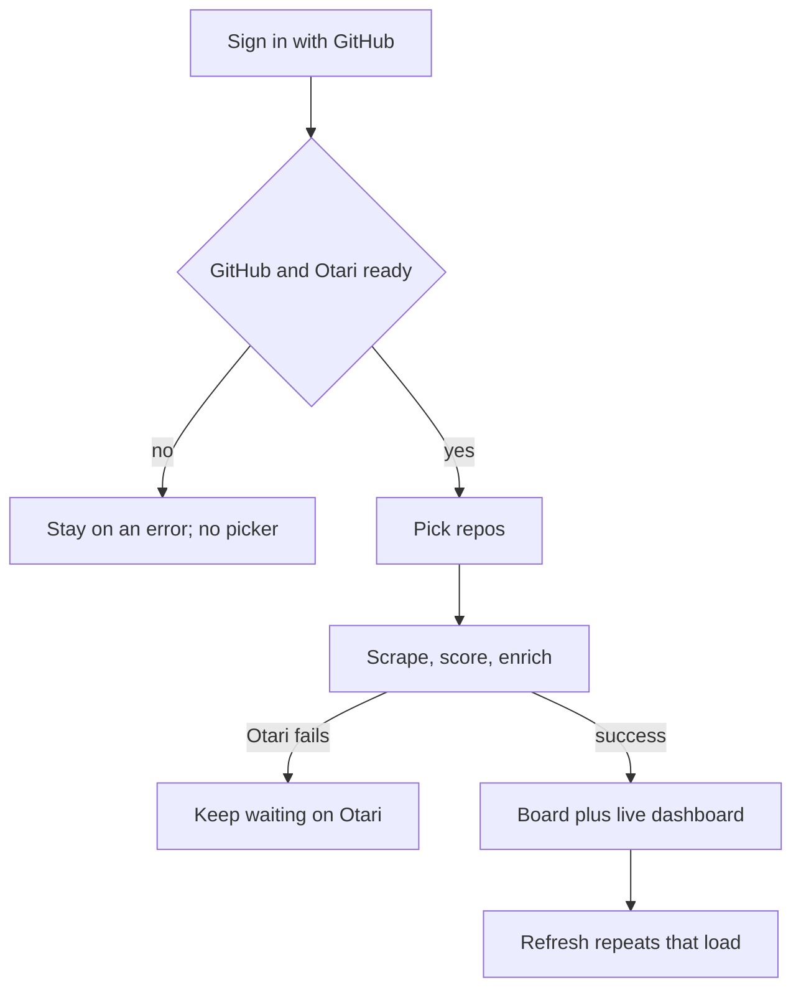
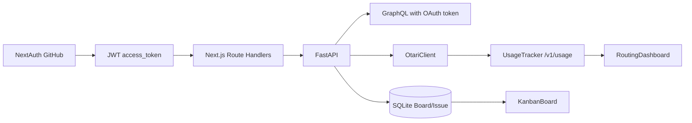

# Local Live GitHub Board - Plan

## Goal Capsule

- **Objective:** After one GitHub sign-in on localhost, the operator picks repos they can access (public and private) and waits until that set is scraped, scored, Otari-enriched, and shown on the Kanban with a live routing dashboard. Refresh repeats that full load.
- **Product authority:** This Product Contract. The original Otari Games 12-task plan remains historical context; it does not authorize cloud deploy or a sample-data board as success for this loop.
- **Open blockers:** None.
- **Product Contract preservation:** R1–R10, A1–A3, F1–F4, AE1–AE6, and session-settled Key Decisions are unchanged; planning only resolved HOW.

---

## Product Contract

### Summary

Ship a localhost-only loop: one GitHub SSO, a GitHub-plus-Otari readiness check, a real repo picker, then a blocked wait until issues, scores, summaries, and the routing dashboard are live. Open issues land in Backlog and closed issues in Done. Do not deploy.

### Problem Frame

The 12-task plan shipped a sign-in button, a Kanban that renders a hardcoded sample list, scrape and enrichment modules that never run from the API process, and a usage dashboard that polls an empty feed. Signing in on localhost does not load the operator's GitHub issues. Two GitHub logins exist (web vs API), the web login does not request repo access, and scrape still expects a separate token. Cloud deploy does not close that gap.

### Key Decisions

- **Localhost only.** (session-settled: user-directed — chosen over Vercel/Railway public URLs: the operator wants GitHub SSO and every feature on this machine, not a hosted app.)
- **Live GitHub board after SSO.** (session-settled: user-directed — chosen over keeping sample cards or scraping a named allowlist only: "all features work" means real issues from repos the signed-in account can read.)
- **Public and private repos the account can access.** (session-settled: user-directed — chosen over public-only or an org allowlist: private issues are in scope.)
- **One Sign in is enough.** (session-settled: user-directed — chosen over a PAT in env or a second API GitHub consent: the SSO token must be able to list and scrape those repos.)
- **Pick, then load.** (session-settled: user-directed — chosen over auto-loading every accessible repo or starting from starred/recent: the operator chooses the set before scrape.)
- **Full wait.** (session-settled: user-directed — chosen over scores-first or issues-only: the loop is not working until issues, scores, Otari summaries/categories, and the routing dashboard all have live data.)
- **Open → Backlog, closed → Done.** (session-settled: user-directed — chosen over five-column Otari placement or GitHub Projects: extra columns stay empty unless a stored status already exists.)
- **Block until Otari succeeds.** (session-settled: user-directed — chosen over showing GitHub data with a failed Otari banner: a missing or exhausted Otari key is a hard stop.)
- **One load per pick, plus refresh.** (session-settled: user-directed — chosen over a background timer or first-load-only: the snapshot stays until the operator picks again or refreshes.)
- **Preflight, then pick, then load.** (session-settled: user-directed — chosen over pick-blind or persisting the board across app restarts: fail GitHub/Otari before the picker, and do not treat SQLite restart restore as this round's success.)

### Actors

- A1. Local operator — the person running the app on this machine, signing in with their GitHub account.
- A2. GitHub — OAuth consent and issue/repo data for that account.
- A3. Otari — hosted enrichment used for summary, category, and the routing dashboard feed.

### Key Flows



- F1. First successful local loop
  - **Trigger:** A1 opens the app on localhost and is not signed in.
  - **Actors:** A1, A2, A3
  - **Steps:** A1 signs in once with GitHub (repo read granted). Preflight confirms GitHub and Otari both answer. A1 picks repos. The app scrapes, scores, and enriches that set and does not show the board as working until all three plus the routing dashboard have live data. Open issues go to Backlog; closed issues go to Done.
  - **Outcome:** A1 sees their chosen repos' issues, scores, Otari summaries, and live routing events.
  - **Covered by:** R1, R2, R3, R4, R5, R6, R8

- F2. Refresh
  - **Trigger:** A1 already has a successful board for a picked set.
  - **Actors:** A1, A2, A3
  - **Steps:** A1 uses an explicit refresh. The same full load runs again for the current set. The board stays blocked on that refresh until Otari succeeds.
  - **Outcome:** The snapshot updates; no background timer is required.
  - **Covered by:** R7, R8

- F3. Preflight failure
  - **Trigger:** GitHub or Otari does not answer before the picker.
  - **Actors:** A1, A2, A3
  - **Steps:** The app shows the failure and does not offer repo picking.
  - **Outcome:** A1 is not left waiting on a blocked board to learn that config is wrong.
  - **Covered by:** R3, R8

- F4. Otari failure after pick
  - **Trigger:** Repos are chosen; scrape may have finished; Otari is down or out of credits.
  - **Actors:** A1, A3
  - **Steps:** The app keeps the load blocked and surfaces the Otari error until enrichment and the dashboard feed succeed. It does not present GitHub-only cards as success.
  - **Outcome:** The loop is not "working" until Otari succeeds.
  - **Covered by:** R6, R8

### Requirements

**Sign-in and access**

- R1. A1 signs in once with GitHub on localhost and that session is enough to list and scrape public and private repositories A1 can access. No personal access token and no second GitHub consent screen.
- R2. After a successful preflight, A1 chooses which of those repositories to include before any scrape of that set begins.

**Readiness and load**

- R3. After sign-in and before the picker, the app checks that GitHub and Otari both answer and blocks picking until they do.
- R4. After a pick, the app loads real issues from those repositories, computes scores from work signals, and Otari-enriches them (summary and category at minimum).
- R5. When that load succeeds, A1 sees the Kanban for that set plus a routing dashboard fed by live Otari usage for this run — not sample cards and not an empty usage table presented as success.
- R6. That board is not treated as working until issues, scores, Otari enrichment, and the routing dashboard all have live data.
- R7. The snapshot stays until A1 picks a different set or uses an explicit refresh. Refresh repeats the same full load. The app does not have to keep updating on a timer, and it does not have to restore the board after a process restart.

**Placement and failure**

- R8. Missing, misconfigured, or exhausted Otari is a hard stop: show the error and keep waiting; do not degrade to GitHub-only cards as a successful loop.
- R9. GitHub open issues go to Backlog. Closed issues go to Done. Triaged, In Progress, and In Review may stay empty unless a status is already stored for that issue.

**Local-only**

- R10. Success is this machine: localhost web, local API, hosted Otari called from the API. A public URL is not required.

### Acceptance Examples

- AE1. Preflight catches Otari before pick
  - **Covers:** R3, R8
  - **Given:** A1 is signed in and Otari is unreachable or has no key.
  - **When:** A1 would otherwise pick repos.
  - **Then:** The picker is not offered. The Otari failure is visible.

- AE2. Full load is the success bar
  - **Covers:** R4, R5, R6
  - **Given:** Preflight passed and A1 picked at least one repo they can read.
  - **When:** Scrape, scoring, and Otari complete.
  - **Then:** The board shows those repos' real issues with scores and Otari summaries, and the routing dashboard shows live usage from this load — not the sample titles.

- AE3. Otari outage after pick does not count as working
  - **Covers:** R6, R8
  - **Given:** A1 has picked repos and GitHub scrape can succeed.
  - **When:** Otari fails or is out of credits.
  - **Then:** The app stays blocked on that load with the Otari error. GitHub-only cards are not presented as a finished loop.

- AE4. Open and closed placement
  - **Covers:** R9
  - **Given:** A picked repo has one open issue and one closed issue.
  - **When:** The load succeeds.
  - **Then:** The open issue is in Backlog and the closed issue is in Done.

- AE5. Refresh repeats the full load
  - **Covers:** R7
  - **Given:** A successful board is showing.
  - **When:** A1 refreshes.
  - **Then:** The same picked set is scraped, scored, and Otari-enriched again, and the board stays blocked until that Otari pass succeeds.

- AE6. One GitHub consent
  - **Covers:** R1
  - **Given:** A1 has never authorized this app.
  - **When:** A1 clicks Sign in with GitHub and grants access.
  - **Then:** A1 can pick private repos they can access without a PAT and without a second GitHub login.

### Success Criteria

- From a clean localhost start, A1 can sign in, pass preflight, pick repos, and reach a board that is visibly their GitHub data plus live Otari usage, without any cloud host.
- A colleague sitting at this machine can repeat that path with their own GitHub account and the same local env shape (their own OAuth app credentials and Otari key).

### Scope Boundaries

**Deferred for later**

- Background re-scrape while the tab stays open.
- Restoring a picked board across API/web restarts.
- Filling Triaged / In Progress / In Review from Otari judgment or GitHub Projects.
- Wiring GitHub MCP; GraphQL (or equivalent GitHub HTTP) remains the scrape path.

**Outside this round**

- Vercel, Railway, Render, or any public URL.
- A second GitHub OAuth dance on the API origin.
- A `GITHUB_TOKEN` personal access token as the way private scrape works.
- Auto-loading every accessible repo with no picker.

### Dependencies / Assumptions

- A1 can create a GitHub OAuth App and an Otari API key. Hosted Otari stays the enrichment backend; the browser never holds that key.
- GitHub will grant repo read for public and private repositories on that single OAuth consent.
- Local web and API both run on this machine; Otari is reached from the API over the network.
- The existing Kanban, score formula, Otari client, and usage dashboard remain the product surfaces; this work connects them to a signed-in live load.

### Outstanding Questions

Resolved in the Planning Contract as KTD1–KTD4. No product questions remain open.

### Sources / Research

Verified against the tree on 2026-08-24 (all nine claims confirmed):

- Board page passes a hardcoded sample list into the Kanban; it does not fetch issues.
- The API process exposes health, GitHub auth routes, and usage only — no issue-list or board load from a request.
- The scrape scheduler is registered in the scrape module and is not started from the API process entrypoint.
- GraphQL scrape reads an env token, not a signed-in OAuth access token.
- The web GitHub provider is configured with client id/secret only; it does not set a repo scope.
- The API GitHub login requests `read:user,repo` and is a separate callback from the web login.
- The repo control only filters repo names already on cards; it does not list GitHub repositories.
- The enrichment pipeline is not called from API request handlers.
- The routing dashboard does poll usage via a same-origin path rewritten to the local API.

<!-- ce-section: work-relationships -->

### How This Work Fits Together

This plan owns the **local live loop** (SSO → preflight → pick → one full load → refresh).

The surrounding 12-task Otari Games board (`docs/2026-08-22_otari-games-kanban-board.md`) already shipped UI, scrape/score/enrichment modules, and deploy files. That breakdown is current understanding, not a roadmap this contract must execute.

- **Local live loop (this plan)**
  - **Depends on:** the shipped web Kanban, NextAuth sign-in surface, API Otari client, scoring, and usage dashboard.
  - **Can proceed independently of:** Vercel/Railway deploy config.
- **Cloud deploy**
  - **Can proceed independently of** this plan; it is not success for this round.
- **GitHub MCP scrape**
  - **Still to decide** in a later plan; this round keeps MCP unwired.
- **Five-column workflow placement**
  - **Still to decide** later; this round uses open/closed only.

---

## Planning Contract

### Key Technical Decisions

- **KTD1. One NextAuth GitHub consent; JWT holds the GitHub access token.** (session-settled: user-directed — chosen over a PAT or a second API OAuth: the Sign in on localhost:3000 must grant `repo` plus `read:user`.) Configure `GitHubProvider` with those scopes. Persist `account.access_token` on the JWT in the `jwt` callback. Do not put the access token on the client `session` object. Next.js Route Handlers read it via `getToken` and forward `Authorization: Bearer` to FastAPI. The unused FastAPI `/auth/github` login is not part of this loop.

- **KTD2. FastAPI trusts the forwarded GitHub OAuth token, never `GITHUB_TOKEN`, for this loop.** Preflight, repo list, and scrape call GitHub GraphQL with that bearer token. Reuse `fetch_issues_graphql(owner, repo, token)`. `fetch_issues_graphql_from_env` stays for existing tests but is not the live-loop path. Otari keys stay in API env; the browser never receives them.

- **KTD3. Next.js BFF in front of FastAPI.** Same-origin `/v1/usage` rewrites stay for the dashboard. Preflight, repo list, pick/load, and refresh go through Next.js Route Handlers so the GitHub token never enters client JS. Handlers return pass/fail and board payloads only.

- **KTD4. Snapshot is the current process load, not a restart restore.** On successful load, upsert into existing SQLite `Board`/`Issue` (add summary/category on `Issue` if missing) and keep that row set as the board the UI reads. Refresh deletes/replaces that set and runs the pipeline again. Process restart may empty the board; that is in-contract (R7).

- **KTD5. Humane bound before scrape.** Reject a pick over 15 repos with a visible error. Paginate GraphQL as today (50/page) but stop the load at 200 issues across the set. No cancel control this round.

- **KTD6. Open/closed mapping stays in `_map_issue`.** `CLOSED` → `done`, else `backlog`. Do not write Otari `worked_on` into column status. Preserve an existing non-backlog/non-done status only if already stored (current `_upsert_issues` rule).

### High-Level Technical Design

```mermaid
sequenceDiagram
  participant Op as Operator
  participant Web as Next.js
  participant JWT as NextAuth JWT
  participant API as FastAPI
  participant GH as GitHub GraphQL
  participant Ot as Otari

  Op->>Web: Sign in with GitHub (repo scope)
  Web->>JWT: store access_token
  Op->>Web: open board
  Web->>JWT: getToken
  Web->>API: GET preflight (Bearer GH token)
  API->>GH: viewer
  API->>Ot: config plus cheap ping
  API-->>Web: ready or error
  alt not ready
    Web-->>Op: error; no picker
  else ready
    Web->>API: GET repos
    API->>GH: viewer repositories
    API-->>Web: repo list
    Op->>Web: pick repos
    Web->>API: POST load
    API->>GH: issues
    API->>API: score
    API->>Ot: enrich each issue
    API->>API: UsageTracker.log
    API-->>Web: issues plus usage
    Web-->>Op: Kanban plus dashboard
    Op->>Web: Refresh
    Web->>API: POST load again
  end
```



### Assumptions

- GitHub OAuth Apps still issue a user-to-server token with `repo` that GraphQL accepts as `Authorization: Bearer`.
- A cheap Otari ping (config load plus one short `complete`, or models list if the client already supports it) is enough for preflight.
- next-auth v4 JWT callbacks on Next.js 14 App Router remain the session store (`apps/web` uses `next-auth@^4.24.15`).

### Implementation constraints

- pnpm for JS/TS; uv for Python. Never npm/npx.
- Do not start the APScheduler cron for this loop (R7 forbids background timers).
- Do not wire MCP.
- Do not deploy.
- Keep existing login, kanban, and routing-dashboard tests green; extend them rather than replacing the required fixtures except where SAMPLE_ISSUES must leave the live page.

### Sequencing

U1 (SSO token) → U2 (API bearer + GraphQL) → U3 (preflight + repo list) and U4 (load pipeline) after U2 → U5 (web loop) after U3 and U4 → U6 (docs) last. U3 and U4 may proceed in parallel once U2 is committed if file overlap is avoided (`main.py` vs dedicated routers).

---

## Implementation Units

### U1. Persist GitHub SSO token for API calls

- **Goal:** One Sign in with GitHub requests repo read and stores the access token in the JWT so server code can call GitHub on behalf of A1.
- **Requirements:** R1, AE6, KTD1
- **Dependencies:** none
- **Files:** `apps/web/app/api/auth/[...nextauth]/route.ts`, `apps/web/types/next-auth.d.ts` (create if needed), `apps/web/__tests__/auth-token.test.ts` (or equivalent)
- **Approach:** Set GitHub authorization params to `read:user repo`. In `jwt`, copy `account.access_token` onto the token on first sign-in and keep it on later jwt calls. Leave `session` callback free of the raw token. Existing login button and `/login` page stay.
- **Execution note:** Add a unit test that the NextAuth config requests repo scope (assert on the provider options object, not a live OAuth round-trip).
- **Patterns to follow:** current `GitHubProvider` in `apps/web/app/api/auth/[...nextauth]/route.ts`; Auth.js JWT callback pattern (token on jwt, not client session).
- **Test scenarios:**
  - Happy path: GitHub provider authorization includes `repo` and `read:user`.
  - Edge: jwt callback without `account` preserves a previously stored access token field.
  - Error: missing `GITHUB_ID`/`GITHUB_SECRET` still fails closed as today (login test remains).
- **Verification:** Login vitest still passes. Typecheck passes. Inspecting the route shows scope plus jwt persistence and no access token on `session`.

### U2. Scrape and FastAPI accept the OAuth bearer

- **Goal:** GraphQL scrape and new API routes use the signed-in GitHub token instead of `GITHUB_TOKEN`.
- **Requirements:** R1, R4, KTD2
- **Dependencies:** U1
- **Files:** `apps/api/src/scraper/github_graphql.py`, `apps/api/src/scraper/cron.py`, `apps/api/src/auth/bearer.py` (or similar), `apps/api/tests/test_scraper.py`, `apps/api/tests/test_auth.py`
- **Approach:** Keep `fetch_issues_graphql(owner, repo, token)`. Add a FastAPI dependency that reads `Authorization: Bearer`. Add `scrape_repo(..., token=)` that uses that token on GraphQL fallback (MCP still stub-fails into GraphQL). Do not require `GITHUB_TOKEN` for the live loop.
- **Execution note:** Extend scraper tests with a mocked httpx transport proving the Authorization header is the passed token, not env.
- **Patterns to follow:** `fetch_issues_graphql` and `test_graphql_fallback_query` / `test_scrape_repo_falls_back_to_graphql`.
- **Test scenarios:**
  - Happy path: `fetch_issues_graphql` sends `Authorization: Bearer <token>`.
  - Covers AE6 / R1: scrape helper called with an OAuth token succeeds without `GITHUB_TOKEN` in env.
  - Error: missing/invalid bearer on a protected route returns 401.
- **Verification:** `uv run pytest tests/test_scraper.py tests/test_auth.py` passes.

### U3. Preflight and repo list

- **Goal:** After sign-in, the app proves GitHub and Otari answer, then lists repositories the token can read. Picker is withheld until preflight passes.
- **Requirements:** R2, R3, R8, AE1, F3, KTD2, KTD3, KTD5
- **Dependencies:** U2
- **Files:** `apps/api/src/live/preflight.py` (or `apps/api/src/board/preflight.py`), `apps/api/src/main.py`, `apps/web/app/api/live/preflight/route.ts`, `apps/web/app/api/live/repos/route.ts`, `apps/api/tests/test_preflight.py`, `apps/web/__tests__/preflight.test.ts`
- **Approach:** `GET` preflight: GraphQL `viewer { login }`; Otari via `OtariConfig.from_env()` plus one short `complete` (or equivalent). Return `{ github: ok|error, otari: ok|error }` with messages, never secrets. `GET` repos: viewer repositories (owner/name, include private). Next handlers use `getToken` and proxy. Cap listed repos reasonably; picking more than 15 is rejected at load (U4) if the list is large.
- **Execution note:** Pytest with mocked GitHub/Otari first (red), then implement.
- **Patterns to follow:** `OtariConfig.from_env` RuntimeError when key missing; `tests/test_otari.py` for env failure.
- **Test scenarios:**
  - Covers AE1: Otari key missing → preflight otari error; Next/UI must not treat as ready.
  - Happy path: both probes succeed → ready.
  - Error: GitHub 401 → github error, picker blocked.
  - Integration: Next handler without JWT returns 401 and does not call FastAPI as an anonymous client with a real Otari key leak.
- **Verification:** New API tests pass. Preflight never returns `OTARI_API_KEY`.

### U4. Full load: scrape, score, enrich, usage

- **Goal:** A picked repo set is scraped, scored, Otari-enriched, usage-logged, and stored as the current board. Failure of Otari fails the load.
- **Requirements:** R4, R5, R6, R7, R8, R9, AE2, AE3, AE4, AE5, KTD4, KTD5, KTD6
- **Dependencies:** U2
- **Files:** `apps/api/src/models/issue.py`, `apps/api/src/live/load.py` (or similar), `apps/api/src/main.py`, `apps/api/src/enrichment/pipeline.py`, `apps/api/src/otari/client.py` (only if logging usage needs token counts), `apps/api/src/otari/usage.py`, `apps/web/app/api/live/load/route.ts`, `apps/api/tests/test_live_load.py`
- **Approach:** `POST` load with `{ repos: string[] }`. Reject >15 repos. For each repo, GraphQL scrape with bearer, `score_issue`, `EnrichmentPipeline.enrich`; on any Otari exception, abort and return an error — do not persist a GitHub-only success payload. On success, upsert issues (including summary/category), `UsageTracker.log` per completion (model, tokens if present else 0, cost 0 if unknown, feature summary|category|judgment). Return issues for the Kanban. Refresh is the same POST. Do not start APScheduler.
- **Execution note:** Test-first: load with mocked GitHub success and Otari failure must not return issues as success.
- **Patterns to follow:** `EnrichmentPipeline.enrich`, `score_issue`, `_upsert_issues`, `UsageTracker.log`, `_map_issue` status mapping.
- **Test scenarios:**
  - Covers AE2: mocked scrape + three Otari completes → payload has scores, summary, category; tracker has events.
  - Covers AE3: Otari raises → load error, no successful issue list.
  - Covers AE4: OPEN maps backlog, CLOSED maps done.
  - Covers AE5: second POST replaces the snapshot (titles from the new mock, not the first).
  - Edge: 16 repos → 400 before GitHub calls.
- **Verification:** `uv run pytest tests/test_live_load.py tests/test_usage.py` passes. Cron scheduler still not started from `main.py`.

### U5. Board UI: pick, wait, live cards, refresh

- **Goal:** The board page runs the local loop instead of `SAMPLE_ISSUES`.
- **Requirements:** R2, R3, R5, R6, R7, R8, R10, F1, F2, AE2
- **Dependencies:** U1, U3, U4
- **Files:** `apps/web/app/board/[id]/page.tsx`, `apps/web/components/LiveBoard.tsx` (create), `apps/web/components/RepoPicker.tsx` (keep column filter; add or reuse a selection control for GitHub repos), `apps/web/components/KanbanBoard.tsx`, `apps/web/__tests__/kanban.test.tsx`, `apps/web/__tests__/live-board.test.tsx`, `apps/web/__tests__/routing-dashboard.test.tsx`
- **Approach:** Client island after auth: call preflight; on failure show error and no picker. On success, multi-select from repo list, submit load, show a blocking loading state until success or Otari/GitHub error. On success render `KanbanBoard` with returned issues (not samples) and `RoutingDashboard`. Explicit Refresh button re-POSTs the same set. Keep `RepoPicker` as the in-board column filter. Existing kanban fixture test still renders `KanbanBoard` with `{ id: 1, title: "Test issue", score: 5.2 }`.
- **Execution note:** Vitest the live island with mocked fetch: preflight fail hides picker; success path shows a real title from the load payload; Otari error keeps loading/error and not sample titles.
- **Patterns to follow:** `RoutingDashboard` loading/error; login page always showing GitHub button; `kanban.test.tsx` required fixture.
- **Test scenarios:**
  - Covers AE1: preflight otari error → no pick control.
  - Covers AE2: load payload title appears; sample titles "Add dark mode" / "Fix login redirect" are absent.
  - Covers AE3: load 503/error → error UI, no sample success board.
  - Happy path: Refresh triggers a second POST to load.
  - Regression: `renders board with issues` still passes.
- **Verification:** `CI=true pnpm --filter web test` and `pnpm --filter web exec tsc --noEmit` pass.

### U6. Local env and README for the one-SSO loop

- **Goal:** Docs match the live loop: web env + Otari on the API; no PAT as the private-scrape method.
- **Requirements:** R10, KTD1
- **Dependencies:** U5
- **Files:** `README.md`, `.env.example`
- **Approach:** Document `apps/web/.env.local` (`GITHUB_ID`, `GITHUB_SECRET`, `NEXTAUTH_SECRET`, `NEXTAUTH_URL`, `API_ORIGIN`) and API `OTARI_API_KEY` / `OTARI_BASE_URL`. State GitHub OAuth callback `http://localhost:3000/api/auth/callback/github` and that the app requests `repo` scope. Mark `GITHUB_TOKEN` and API `/auth/github` as unused for this loop. Do not invent secrets.
- **Test expectation:** none — documentation only.
- **Verification:** README path matches the implemented BFF and env names.

---

## Verification Contract

- API: `cd apps/api && uv run pytest -q` — include `test_scraper`, `test_preflight`, `test_live_load`, `test_usage`, `test_health`.
- Web: `CI=true pnpm --filter web test` and `pnpm --filter web exec tsc --noEmit`.
- Manual (operator keys required, not a CI gate): sign in on `http://localhost:3000/login`, pass preflight, pick a small public repo, wait for Otari, confirm cards are that repo’s issues and `/v1/usage` is non-empty. Unset `OTARI_API_KEY` and confirm picker is blocked.

## Definition of Done

- R1–R10 and AE1–AE6 are covered by U1–U6 tests or the documented manual check.
- Sample-issue titles are not the signed-in success board.
- FastAPI `/auth/github` is not required for the loop.
- APScheduler is not started from `main.py`.
- No Vercel/Railway work, no MCP wiring, no PAT requirement in README for this loop.
- Abandoned spike code is not left in the diff.

## Deferred to Follow-Up Work

- Background re-scrape / cron.
- Restore board across process restart.
- Five-column Otari or GitHub Projects placement.
- GitHub MCP scrape.
- Load cancel and progress UI beyond a single blocking state.
