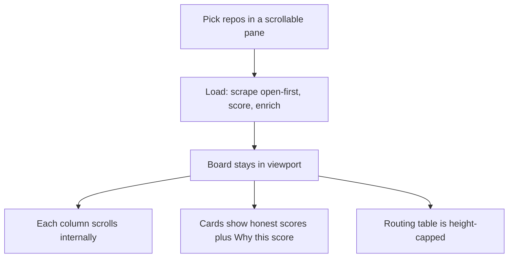

# Board Viewport Scroll and Scores - Plan

## Goal Capsule

- **Objective:** After a successful live load, `/board/1` stays inside the viewport: the repo picker pane scrolls internally, each Kanban column scrolls internally, and the routing table is height-capped. Open issues fill Backlog first. Scores stay honest (formula unchanged); zeros are diagnosable via the existing tooltip. Do not turn this into a landing-page redesign.
- **Product authority:** This Product Contract for layout, scrape order, and score honesty. The live-loop Product Contract in `docs/plans/2026-08-24-001-feat-local-live-loop-plan.md` still governs SSO, preflight, pick-then-load, Open to Backlog, closed to Done, and block-until-Otari.
- **Open blockers:** None. Session-settled Key Decisions below are closed.
- **Product Contract preservation:** Live-loop R1-R10 stay in force. This plan adds layout and scrape-order requirements only.

**Design read:** product kanban dashboard for a local Otari Games operator, GitHub-devtool language, dense data UI. `design-taste-frontend` is explicitly not for dashboards. Apply only containment, density, and existing tokens. No hero, no GSAP, no bento, no landing-page motion. Dials: variance 3-4, motion 2-3, density 8-9.

---

## Product Contract

### Summary

The board loaded, but the page grew with every repo checkbox, Done card, and routing row. Tickets piled into Done at score 0.0 because GraphQL returned the oldest mixed OPEN+CLOSED issues first (cap 20). Contain the panes. Prefer recent open issues so Backlog fills and scores can be non-zero. Do not invent a new scoring formula. Do not parse hosted Otari usage in this round.

### Problem Frame

Operator screenshots of `/board/1` after a successful load:

1. The document scrolls for a long time. The picker checkbox list, Done column (~20 cards), and routing table all grow the page.
2. The repo picker is not an internally scrollable pane. The operator must scroll the whole page to walk the mozilla-ai catalog.
3. Backlog / Triaged / In Progress / In Review show 0. Done holds every card.
4. Every card shows score 0.0.
5. The routing table dumps one row per enrich call: model `mzai:moonshotai/Kimi-K2.6`, tokens 0, cost $0.0000.

Root causes (verified in code, not guessed from the screenshot):

- `.live-board` in `apps/web/app/globals.css` is a flex column with no max-height. `.live-board-picker fieldset` has no `max-height` / `overflow-y`. `.kanban-column` has `min-height: 16rem` and no inner overflow. `.routing-dashboard-table-wrap` is `overflow-x: auto` only.
- Live picker is the checkbox fieldset in `apps/web/components/LiveBoard.tsx`. `RepoPicker.tsx` is an in-board filter of already-loaded issues, not the load picker.
- `ISSUES_QUERY` in `apps/api/src/scraper/github_graphql.py` uses `states: [OPEN, CLOSED]` with no `orderBy`. GitHub GraphQL default is typically CREATED_AT ASC. `LIVE_MAX_ISSUES` default 20 on `mozilla-ai/otari` (313 issues) therefore prefers the oldest closed tickets. `_map_issue` sets `status` to `"done"` when CLOSED else `"backlog"`. Extra columns stay empty unless a stored status exists. That is the live-loop contract, not a Kanban bug.
- Score formula in `apps/api/src/scoring/engine.py` is `0.5*log1p(commits) + 0.3*log1p(subtasks) + 0.2*log1p(comments)` times `0.5^(days/30)`. `_map_issue` hardcodes `subtasks_count` to 0. Old closed issues decay to ~0. Open issues often have 0 closing-PR commits. Display 0.0 is often correct. `IssueCard` already wraps `ScoreTooltip`.
- `_log_enrichment` in `apps/api/src/live/load.py` logs `tokens=0, cost=0.0`. Hosted Otari `GET /v1/usage` 404s. That is a telemetry stub, not a scoring bug.

### Key Decisions

- **Dashboard containment only.** (session-settled: user-directed - chosen over a taste-skill landing overhaul: the surface is a kanban dashboard; apply scroll panes and density, not heroes or GSAP.)
  - **How:** Flex-contain `.live-board` from below `.app-header` + `h1` + `.board-hint` in `apps/web/app/board/[id]/page.tsx`. Use `min-height: 0` down the chain. Do not use `h-screen` (taste skill bans it for full-height heroes; it also fights the sticky header). Prefer `min-h-[something]` / `calc(100dvh - header - title)` on `.live-board` only.
- **Fill the load cap with open issues first.** (session-settled: user-directed - chosen over keeping mixed OPEN+CLOSED in GitHub default order: Backlog should populate; closed issues may still fill remaining slots.)
  - **How:** Live load queries OPEN with `orderBy: { field: UPDATED_AT, direction: DESC }`, paginates until the remaining cap, then fills leftover slots from CLOSED the same way. Do not switch the live loop to OPEN-only. Keep `_map_issue` (closed → Done, else Backlog). Multi-repo: walk picked slugs in picker order; each repo contributes until the shared remaining cap is 0.
- **Do not invent scores.** (session-settled: user-directed - chosen over faking activity: keep the existing formula; make 0.0 readable via the existing tooltip.)
  - **How:** After OPEN-first, recent commented issues can be non-zero. Open issues with no comments and no closing-PR commits stay 0.0. Verify `_serialize_issue` still passes `commits_on_closing_prs`, `comments_count`, `subtasks_count`, `last_activity_at`. `subtasks_count` stays hardcoded 0. Formula in `apps/api/src/scoring/engine.py` is unchanged.
- **Routing table height only.** (session-settled: user-directed - chosen over parsing real Otari usage this round: leave tokens/cost as the stub; cap table height.)
  - **How:** `.routing-dashboard-table-wrap` gets `max-height` ~14rem and `overflow: auto` (today it is overflow-x only). Do not parse hosted Otari usage.

### Actors

- A1. Local operator - the person using `/board/1` after GitHub SSO.
- A2. GitHub GraphQL - issue list order and activity fields for the picked repos.
- A3. Existing score and Kanban components - formula and columns already shipped.

### Key Flows

- F1. Pick without page-scroll
  - **Trigger:** Preflight is ready and the mozilla-ai catalog is long.
  - **Actors:** A1
  - **Steps:** A1 opens the picker. The fieldset pane scrolls. The rest of the page does not grow with every checkbox.
  - **Outcome:** Load board stays reachable without scrolling through the full catalog.
  - **Covered by:** R1

- F2. Board after load
  - **Trigger:** A1 loads a set that includes a large repo such as mozilla-ai/otari.
  - **Actors:** A1, A2, A3
  - **Steps:** Scrape fills the cap with open issues first (then closed if slots remain). Open cards land in Backlog. Each Kanban column scrolls internally. Scores use the existing formula. The routing table is height-capped.
  - **Outcome:** A1 sees Backlog cards without scrolling the whole document. Zeros remain honest and inspectable.
  - **Covered by:** R2, R3, R4, R5, R6

### Requirements

- R1. The live repo picker fieldset is a bounded pane with `overflow-y: auto`. Walking the catalog does not lengthen the document.
- R2. After load, the Kanban column bodies (not the page) scroll when a column has many cards. Horizontal column scroll may remain for narrow viewports.
- R3. The live-board plus Kanban region is contained so Done plus the routing table do not force endless document scroll as the primary interaction.
- R4. GraphQL scrape for the live load prefers open issues (and recent activity) so the default 20-issue cap does not dump oldest closed tickets into Done.
- R5. Open issues still map to Backlog and closed issues to Done. Extra columns stay empty unless a stored status already exists.
- R6. Scoring formula is unchanged. Persist commits, comments, subtasks, last_activity_at. Do not fake non-zero scores. Keep `ScoreTooltip` as the diagnosis UI.
- R7. The routing dashboard table is height-capped with internal scroll. Do not change usage accounting in this plan.
- R8. No landing-page restyle: keep existing CSS variables, fonts, and dark board chrome. Taste skill applies containment only.

### Acceptance Examples

- AE1. Given a long mozilla-ai picker list, when A1 opens `/board/1` after preflight, then the picker pane scrolls and Load board stays on screen without scrolling the document through the whole list.
- AE2. Given a successful load of mozilla-ai/otari (cap 20), when the board appears, then Backlog has open issues (not 0/20 Done-only) and each column body scrolls instead of stretching the page.
- AE3. Given a card with score 0.0, when A1 opens "Why this score?", then commits, subtasks, comments, last activity, and the formula are visible. The number is not invented.
- AE4. Given the routing table has many stub rows, when A1 views the dashboard, then the table pane scrolls and the page does not grow unbounded.

### Test Strategy

- T1. CSS / component: LiveBoard picker fieldset has a max-height and overflow-y. Kanban column body is an overflow-y region. Routing table wrap has a max-height.
- T2. Scraper: `ISSUES_QUERY` (or the live-load fetch path) requests open issues first and/or `orderBy: { field: UPDATED_AT, direction: DESC }`. Existing assertions that the query still contains commits, comments, reactions, and CROSS_REFERENCED_EVENT stay true.
- T3. Load mapping: closed still serializes as `done`; open as `backlog`. A fixture of mixed OPEN+CLOSED with cap 20 prefers open.
- T4. Score: `score_issue` tests unchanged. Do not add a test that requires non-zero score without activity inputs.
- T5. Browser: after load, picker pane scroll, column pane scroll, Backlog non-empty for a repo that has open issues.

### Scope

**In:**

- `apps/web/app/globals.css` containment for `.live-board-picker fieldset`, `.kanban-column` inner list, `.live-board` / `.kanban-columns`, `.routing-dashboard-table-wrap`.
- Small markup in `LiveBoard.tsx` / `KanbanBoard.tsx` if a column body wrapper is required for overflow.
- `apps/api/src/scraper/github_graphql.py` live issue query order (open-first and/or UPDATED_AT DESC).
- Tests in `apps/api/tests/test_scraper.py` and `apps/api/tests/test_live_load.py`.
- Optional copy on the kanban scroll hint if columns now also scroll vertically.

**Out:**

- Landing-page / Awwwards restyle, new fonts, GSAP, bento, glassmorphism.
- Changing the score formula or fabricating activity.
- Implementing subtasks from GitHub (still 0 unless already present).
- Parsing hosted Otari `/v1/usage` into real tokens/cost.
- Five-column workflow placement (triaged / in_progress / in_review stay empty unless stored).
- Changing `LIVE_MAX_ISSUES` default (stays 20 unless the operator already set it).
- Committing `.env`, `featuremania.db`, or unrelated live-loop diffs on dirty `dev`.

### Success Criteria

The operator can pick from mozilla-ai without scrolling the whole page, then see Backlog cards in a viewport-contained board. Scores remain the existing formula. Routing rows no longer stretch the document.

### Assumptions and Constraints

- Localhost only. Both `pnpm --filter web dev` and `uv run uvicorn` on :8000 stay required.
- `LIVE_MAX_ISSUES` default 20 still applies; this plan changes *which* 20, not the cap.
- Open issues often still score 0.0 (no closing-PR commits, subtasks 0). That is acceptable if the tooltip explains it.
- Taste-skill dashboard exception: do not apply hero / eyebrow / bento rules to this page.

---

## Planning Contract

### Technical Design

**Page chrome (locked tokens).** `apps/web/app/board/[id]/page.tsx` is `<main>` + `<h1>Board {id}</h1>` + `.board-hint` + `<LiveBoard />`. Header is `.app-header` in `apps/web/app/layout.tsx`. Do not change these existing values unless the leftover calc needs them:
- `.app-header { padding: 0.75rem 1.5rem 0 }`
- `main { padding: 1.5rem }`
- `h1 { font-size: 1.5rem; margin-bottom: 1rem }`
- `.board-hint` shares `font-size: 0.9rem; margin-bottom: 1rem; max-width: 40rem`

Containment must leave those heights. `.live-board` is the flex root that absorbs leftover viewport (`calc(100dvh - header - title - hint - main padding)`), not the whole `100vh`. Never use `h-screen`. Keep `html, body { overflow-x: hidden }`; the bug is unbounded **vertical** document growth.

**Picker pane.** Live picker is `.live-board-picker` / `fieldset` in `apps/web/components/LiveBoard.tsx`. Markup today: form → fieldset (legend + checkbox labels) → sibling `<button type="submit">Load board</button>`. The button is **already outside** the fieldset; keep it there. `RepoPicker.tsx` is an in-board **filter** of already-loaded issues; do not treat it as the live picker.

Keep current fieldset chrome: `border: 1px solid var(--border); border-radius: 8px; padding: 0.75rem 1rem; gap: 0.4rem`. Add only:
- `max-height: min(40vh, 18rem)`
- `overflow-y: auto`

Update `.board-hint` in `apps/web/app/board/[id]/page.tsx` (today: “Columns scroll sideways on small screens.”) and `.kanban-scroll-hint` in `KanbanBoard.tsx` (today: “Scroll sideways to see all columns.”) so both **vertical column scroll** and sideways overflow are named. Hint CSS today: `.kanban-scroll-hint { display: none }` except at `max-width: 40rem`.

**Kanban columns.** `KanbanBoard.tsx` currently renders `.kanban-columns` > `.kanban-column` > `.kanban-column-header` then **IssueCard siblings** (no inner body wrapper). Add `.kanban-column-inner` around the card map.

Existing tokens to keep:
- `.kanban-columns { grid-template-columns: repeat(5, minmax(11rem, 16rem)); overflow-x: auto; max-width: 100%; gap: 0.75rem }`
- `.kanban-column { background: var(--surface-2); border-radius: 8px; padding: 0.75rem }`

Change:
- Drop `.kanban-column { min-height: 16rem }` if it fights inner scroll.
- `.kanban-column-inner { overflow-y: auto; flex: 1; min-height: 0; max-height: min(60vh, 32rem) }`

**`min-height: 0` chain (required or inner scroll fails):** `main` → `.live-board` → `.kanban` → `.kanban-columns` → `.kanban-column` → `.kanban-column-inner`.

**Scrape pagination (locked).** `ISSUES_QUERY` today (`apps/api/src/scraper/github_graphql.py` ~58–88): `states: [OPEN, CLOSED]`, **no `orderBy`**, `first: 50`, `pageInfo` present. `fetch_issues_graphql` (~283–319) is one mixed loop that stops at `max_issues`. `load_board` already shares remaining cap across repos (`max_issues=remaining`, then `remaining -= len(batch)`).

Implement:
- Change the GraphQL signature to `query($owner: String!, $name: String!, $cursor: String, $states: [IssueState!])`.
- Add `orderBy: { field: UPDATED_AT, direction: DESC }` on `issues(...)`.
- Keep `commits`, `comments`, `reactions`, `CROSS_REFERENCED_EVENT`, `updatedAt` in every query variant.
- **Live path** (`load_board` → `fetch_issues_graphql`): two passes against the **same remaining cap**. Pass 1: `$states: [OPEN]` + UPDATED_AT DESC. Pass 2: `$states: [CLOSED]` + UPDATED_AT DESC for leftover slots only. Stop paging a pass when remaining is 0 (`hasNextPage` true must not trigger another POST).
- **Cron** (`apps/api/src/scraper/cron.py` `scrape_repo` ~86, `fetch_issues_graphql_from_env`): keep the **mixed** default (`$states: [OPEN, CLOSED]`, current order) unless explicitly parameterized. Do not silently change background scrape order.

Two GraphQL queries cost extra rate limit; stay inside `LIVE_MAX_ISSUES` (default 20). Do not paginate past remaining.

**Scores.** `_serialize_issue` in `apps/api/src/live/load.py` already includes score, commits, comments, subtasks, last_activity_at. U3 is verify-only unless a field is dropped on the card. `IssueCard` already has `ScoreTooltip`. Do not fake scores.

**Routing table.** `.routing-dashboard-table-wrap` today is `overflow-x: auto; max-width: 100%` only. Add `max-height: 14rem; overflow: auto`. Leave `_log_enrichment` at `tokens=0, cost=0.0`.

### Dependencies and Sequencing

U1 (CSS/markup containment) can ship without API changes and already stops page-scroll from the picker and columns. U2 (open-first scrape) is required for Backlog vs Done. U3 is verify-only plus tooltip/serialize if a field is dropped. U4 is CSS-only and can land with U1.

Order: U1 + U4 together, then U2, then U3 verification.

### Risks

- OPEN-first still yields 0.0 if those 20 opens have no comments and no closing-PR commits. Mitigation: tooltip honesty, not fake numbers.
- Two GraphQL queries (OPEN then CLOSED) cost extra rate limit. Mitigation: stay inside the existing 20-issue cap; stop paging when remaining is 0.
- Flex overflow needs `min-height: 0` on every parent from `.live-board` through `.kanban-column-inner`; missing one ancestor is the usual reason inner scroll fails and the page grows again.
- Header + h1 + hint eat vertical space. If `.live-board` uses a too-large `calc`, the footer/routing table clips. Size against leftover `100dvh`, not `h-screen`.
- Shared `fetch_issues_graphql` used by cron: changing the default mixed query without a `states` argument could change background scrape order. Mitigation: live load passes states/order; cron keeps current mixed query unless tests prove it must share.

---

## Implementation Units

### U1. Viewport containment for picker and Kanban

- **Goal:** Picker pane and column bodies scroll; the document is not the primary scrollbar for those lists.
- **Files:** `apps/web/app/globals.css`, `apps/web/app/board/[id]/page.tsx` (hint copy only if needed), `apps/web/components/LiveBoard.tsx` (Load board outside fieldset if it is inside today), `apps/web/components/KanbanBoard.tsx` (`.kanban-column-inner` wrapper), `apps/web/__tests__/live-board.test.tsx` if structure selectors change.
- **Tests:** picker fieldset is overflow-y + max-height; column cards live inside `.kanban-column-inner`; Load board is not inside the scrolling fieldset; existing LiveBoard tests still pass.
- **Done when:** AE1 and the column-scroll half of AE2 hold.

### U2. Open-issues-first scrape for the live cap

- **Goal:** Default 20 issues are not the oldest closed tickets.
- **Files:** `apps/api/src/scraper/github_graphql.py`, `apps/api/src/scraper/cron.py` only if the helper signature changes, `apps/api/tests/test_scraper.py`, `apps/api/tests/test_live_load.py`.
- **Keep:** `test_graphql_fallback_query` still asserts `commits`, `comments`, `reactions`, `CROSS_REFERENCED_EVENT` in the query string(s). `test_fetch_issues_graphql_maps_nullable_body` still maps OPEN → `backlog`, CLOSED → `done`, `subtasks_count: 0`; if fetch becomes two-pass, mock two posts or pass `states`.
- **Add:**
  - `test_fetch_issues_graphql_live_open_then_closed_under_cap` — mixed fixture, `max_issues=20`, opens first then closed fillers; GraphQL variables show OPEN then CLOSED and `orderBy` UPDATED_AT DESC.
  - `test_fetch_issues_graphql_does_not_page_past_remaining` — `hasNextPage` true but remaining 0 → no extra post.
  - `test_load_board_prefers_open_issues_under_cap` in `test_live_load.py` — mixed OPEN+CLOSED with cap 20 prefers open.
  - Cron: `scrape_repo` / `fetch_issues_graphql_from_env` still uses mixed states unless explicitly parameterized.
- **Done when:** AE2 Backlog half holds for a repo that has open issues.

### U3. Honest scores

- **Goal:** Confirm activity fields still reach `score_issue` and IssueCard. Do not change the formula.
- **Files:** `apps/api/src/live/load.py` serialize path if a field is dropped; `apps/web/components/IssueCard.tsx` / `ScoreTooltip.tsx` only if a prop is missing. No formula edits in `apps/api/src/scoring/engine.py`.
- **Tests:** existing `score_issue` tests unchanged; no assertion that score must be > 0 without activity inputs; serialize still includes commits/comments/subtasks/last_activity_at.
- **Done when:** AE3 holds. Zero remains legal.

### U4. Routing table height cap

- **Goal:** Usage stub table scrolls in a pane.
- **Files:** `apps/web/app/globals.css` (`.routing-dashboard-table-wrap`).
- **Tests:** wrap has max-height and overflow auto (not overflow-x only). Tokens/cost remain the stub.
- **Done when:** AE4 holds.

---

## Verification Contract

- API: `cd apps/api && uv run pytest -q`
- Web: `CI=true pnpm --filter web test`
- Browser: hard-refresh `http://localhost:3000/board/1`, pick a short mozilla-ai set, load. Confirm picker pane scroll, column pane scroll, Backlog non-empty, ScoreTooltip on a 0.0 card, routing table pane scroll.
- Do not commit unless the operator asks. Leave unrelated dirty `dev` files unstaged.

---

## Definition of Done

- R1-R8 and AE1-AE4 are met.
- Live-loop contract preserved: Open to Backlog, closed to Done, block until Otari, pick then load, localhost only.
- Taste skill applied as dashboard containment only.
- Unit tests above are green. Browser check recorded in the implementation notes.
- This plan is implementation-ready; `ce-work` is the default executor.

## Appendix

- Live-loop plan: `docs/plans/2026-08-24-001-feat-local-live-loop-plan.md`
- Taste skill used as orientation only; Section 13 of that skill excludes dashboards.
- `ce-doc-review` skipped (`skill_unreachable` this session): compact containment/scoring plan on dirty `dev`; KTDs session-settled; no launch-blocking open question. Headless review was not invoked after deepen-3 token lock.
