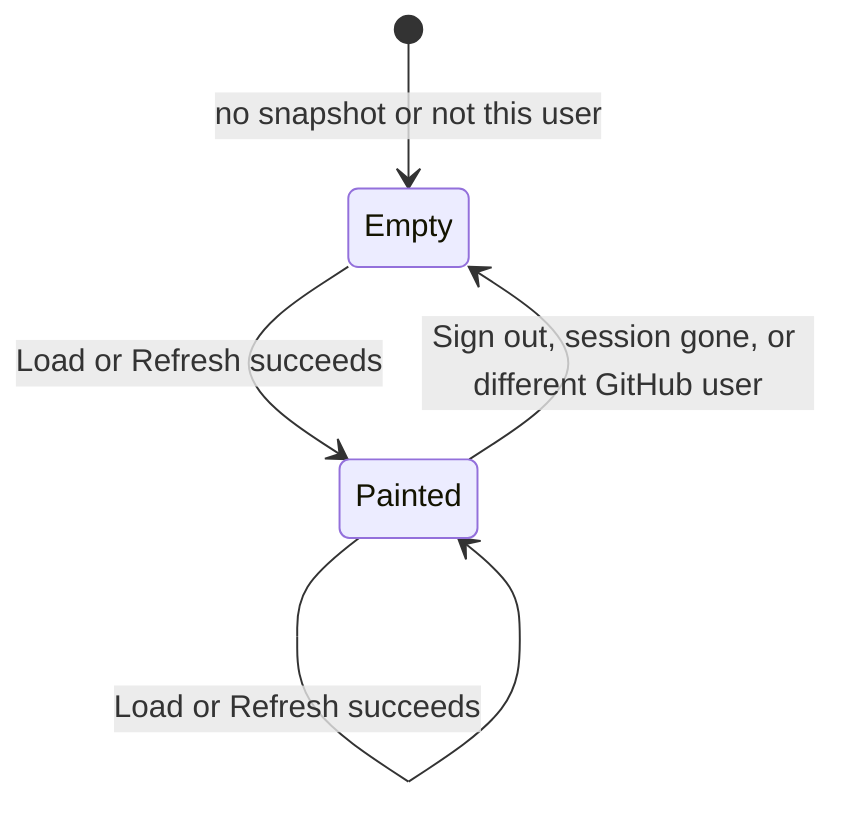
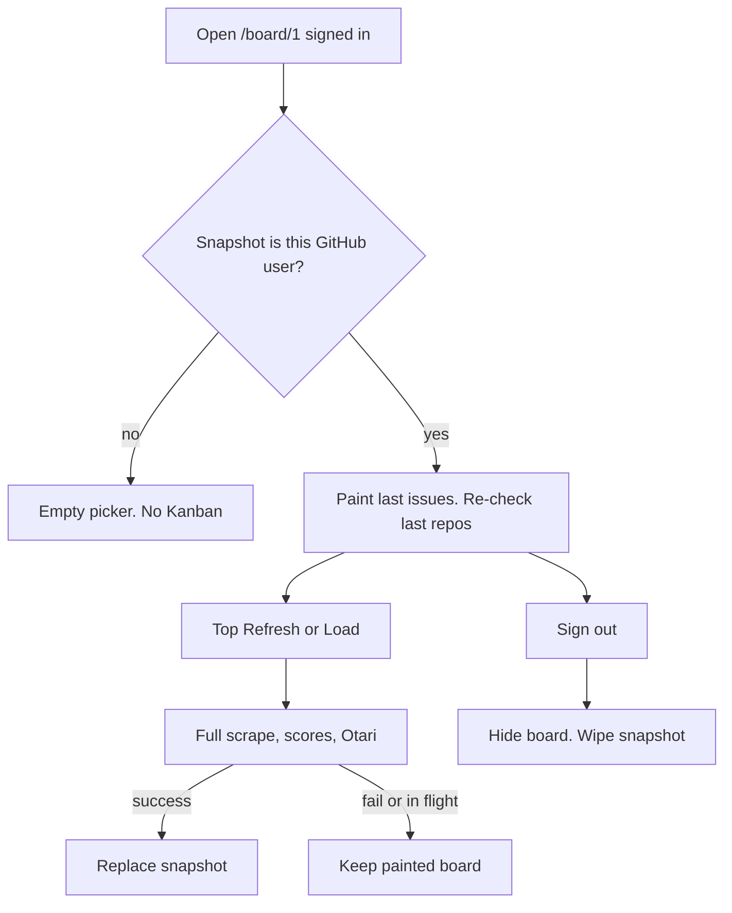
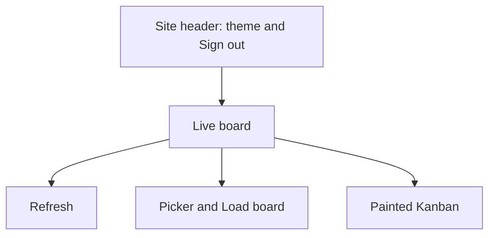

# Live Board Client Snapshot - Plan

## Goal Capsule

- **Objective:** After one successful live load, coming back to `/board/1` as the same GitHub user paints that board and re-checks those repos at once. Load and a top Refresh still run the full scrape, scores, and Otari path. The snapshot is wiped when that user signs out or a different GitHub user is signed in.
- **Product authority:** This Product Contract for restore, invalidation, Sign out, and Refresh placement. `docs/plans/2026-08-24-001-feat-local-live-loop-plan.md` still governs SSO, preflight, pick-then-load, Open to Backlog, closed to Done, and block-until-Otari. For restore after a web reload, this contract supersedes live-loop R7’s “does not have to restore after a process restart.”
- **Open blockers:** None.

---

## Product Contract

### Summary

Keep the last successful Kanban and last repo pick in a browser snapshot keyed to the signed-in GitHub user. Return visits paint that board without waiting on Otari. Load and a top Refresh still do the full slow path. A Refresh in flight or a failed Refresh keeps the painted board. Sign out, a missing session, or a different GitHub user hides the board and wipes the snapshot.

### Problem Frame

A successful load already costs a long Otari wait (default 20 issues, sequential enrich, BFF timeout 180s). Coming back to `/board/1` starts empty: no issues, no last pick, until the operator picks and Loads again. FastAPI already writes a machine-wide SQLite “Live board” and exposes `GET /v1/boards/live`, but the web app never paints it. Failures of Load or Refresh set issues to null and hide the Kanban. There is no Sign out control. The operator’s workaround is to wait the full load every visit.

### Key Decisions

- **Instant paint only.** (session-settled: user-directed — chosen over skip-Otari and hybrid: second visit paints the last success; Load and Refresh still scrape and re-enrich every issue.)
- **Browser snapshot keyed to this GitHub user.** (session-settled: user-directed — chosen over restoring the machine’s shared API snapshot: FastAPI’s live board is one named SQLite row, not per GitHub user, so it cannot honor hide-and-wipe for another account.)
- **Restore last board and last pick.** (session-settled: user-directed — chosen over restoring issues with an empty picker: coming back re-checks the last repos and shows those issues.)
- **Keep until a Load or Refresh succeeds, or the operator signs out.** (session-settled: user-directed — chosen over wiping on fail and over a time limit: a Refresh in flight or a failed Refresh keeps the painted board.)
- **Hide and wipe unless this GitHub user is signed in.** (session-settled: user-directed — chosen over wipe-only-on-the-button and paint-after-preflight: a missing session or a different GitHub user must not show the prior titles.)
- **Refresh at the top of the live board.** (session-settled: user-directed — chosen over leaving Refresh under the Kanban: the operator can start a full reload without scrolling to the current under-board control.)
- **Otari stays backend-only; GitHub token never in client JS.** (session-settled: user-directed — chosen over tokens in the browser: the snapshot may hold issue titles and summaries, not access tokens or Otari keys.)
- **One load per pick plus explicit refresh; no background cron.** (session-settled: user-directed — chosen over timer updates: restore does not start a background load.)

<!-- ce-section: work-relationships -->
### How This Work Fits Together

This plan owns restore and invalidation of the last successful live board in the browser. The surrounding live-loop work is already specified; skip-Otari remains a later candidate.

- Live GitHub loop (`docs/plans/2026-08-24-001-feat-local-live-loop-plan.md`): **Depends on** SSO, preflight, pick-then-load, and full Refresh semantics. This plan **changes** restore-after-reload and failed-Refresh hiding.
- Viewport and scores (`docs/plans/2026-08-26-001-board-viewport-scroll-and-scores-plan.md`): **Shares** the `/board/1` LiveBoard surface. Can proceed independently of this snapshot.
- Skip Otari for unchanged issues: **Can proceed independently of** this plan. Not active scope.
- Routing-dashboard cache and snapshot TTL: **Still to decide**; not this contract.

### Actors

- A1. Local operator — the person using `/board/1` after GitHub SSO.
- A2. GitHub session — the signed-in GitHub identity that owns the snapshot.
- A3. Browser snapshot — last successful issues and last repo pick for that identity.

### Key Flows

- F1. Return paints the last success
  - **Trigger:** A1 opens `/board/1` signed in as the GitHub user who last loaded successfully.
  - **Actors:** A1, A2, A3
  - **Steps:** The last issues paint without waiting on Otari. The picker re-checks those repos. Preflight may still run and still block a new pick if GitHub or Otari fail.
  - **Covered by:** R1, R2, R3
- F2. Top Refresh keeps the board until success
  - **Trigger:** A1 uses Refresh at the top of the live board, or Load after a pick.
  - **Actors:** A1, A3
  - **Steps:** The full scrape, scores, and Otari path run. The painted board stays visible while that runs. Success replaces issues, pick, and snapshot. Failure leaves the painted board and shows the error.
  - **Covered by:** R4, R5, R6
- F3. Sign out wipes
  - **Trigger:** A1 uses Sign out.
  - **Actors:** A1, A2, A3
  - **Steps:** The session ends. The Kanban hides. The snapshot for that GitHub user is gone.
  - **Covered by:** R7, R8
- F4. Wrong or missing identity does not paint
  - **Trigger:** No GitHub session, or a different GitHub user signs in.
  - **Actors:** A2, A3
  - **Steps:** The prior board does not paint. The snapshot is wiped.
  - **Covered by:** R7, R9
- F5. New pick replaces only on success
  - **Trigger:** A1 changes checkboxes and Load succeeds.
  - **Actors:** A1, A3
  - **Steps:** Changing checkboxes does not hide the old board. A successful Load of the new pick replaces issues, pick, and snapshot. A failed Load of the new pick keeps the old painted board.
  - **Covered by:** R5, R6

### Requirements

**Restore**

- R1. When A1 returns to `/board/1` signed in as the GitHub user of the last successful load, the last issues paint at once from the browser snapshot.
- R2. That return also re-checks the last picked repositories in the picker.
- R3. Restore does not wait on Otari. Preflight still blocks a new pick when GitHub or Otari fail.

**Load and Refresh**

- R4. A Refresh control sits at the top of the live board whenever a board is painted, including while a load is in flight.
- R5. Load board and that Refresh both run the full scrape, scores, and Otari path. They do not skip Otari for unchanged issues.
- R6. While Load or Refresh is in flight, and if it fails, the painted board stays. Only a successful Load or Refresh replaces the painted issues and the snapshot.

**Identity and wipe**

- R7. The snapshot is keyed to the signed-in GitHub user. A missing session or a different GitHub user hides the board and wipes that snapshot.
- R8. A Sign out control is available while A1 is signed in. Using it ends the session, hides the board, and wipes the snapshot.

**Secrets**

- R9. The snapshot may hold issue titles, summaries, scores, and the last pick. It must not hold the GitHub access token or Otari keys.

### Acceptance Examples

- AE1. Second visit paints without Otari
  - **Covers:** R1, R2, R3
  - **Given:** A1 loaded mozilla-ai/otari successfully, then reloaded `/board/1` still signed in as the same GitHub user.
  - **When:** The page is ready.
  - **Then:** Those issues are already on the Kanban. mozilla-ai/otari is still checked. Otari has not been called yet for this visit.
- AE2. Failed Refresh keeps the board
  - **Covers:** R4, R5, R6
  - **Given:** A painted snapshot is on screen.
  - **When:** A1 uses the top Refresh and Otari or GitHub fails.
  - **Then:** The Kanban still shows the previous issues. The error is visible. The snapshot is unchanged.
- AE3. Successful Refresh replaces
  - **Covers:** R5, R6
  - **Given:** A painted snapshot is on screen.
  - **When:** Top Refresh completes successfully.
  - **Then:** The Kanban and snapshot match the new load. The picker still reflects the repos used for that success.
- AE4. Sign out wipes
  - **Covers:** R7, R8
  - **Given:** A snapshot exists for this GitHub user.
  - **When:** A1 uses Sign out, then later signs in as the same user.
  - **Then:** The board does not paint from the old snapshot. The picker starts empty.
- AE5. Different GitHub user does not see the board
  - **Covers:** R7, R9
  - **Given:** User A left a snapshot in this browser.
  - **When:** User B signs in on the same browser.
  - **Then:** User A’s issues do not paint. That snapshot is gone. No GitHub token or Otari key is in the store.
- AE6. Changing the pick does not hide the old board
  - **Covers:** R2, R6
  - **Given:** The last success was repo set X, painted on screen.
  - **When:** A1 unchecks X, checks Y, and Load fails.
  - **Then:** Set X remains painted until a later Load or Refresh succeeds.

### Success Criteria

- A return visit as the same GitHub user shows the last Kanban before Otari runs.
- Load and top Refresh remain a full slow path; operators who want fresh Otari still wait.
- Another GitHub user on the same browser never sees the prior titles.
- Sign out leaves no snapshot for the next session.

### Scope Boundaries

**In this work**

- Browser snapshot of last successful issues and last pick, keyed to GitHub user.
- Top Refresh on the live board.
- Sign out that wipes the snapshot.
- Keep painted board through in-flight and failed Load or Refresh.

**Deferred for later**

- Skipping Otari or GitHub scrape for issues whose GitHub updated time has not changed.
- Caching the routing dashboard.
- Time-based expiry of the snapshot.

**Out of scope**

- Putting GitHub tokens or Otari keys in the browser.
- Restoring from FastAPI’s shared SQLite live board as the product source of truth.
- Background cron or auto-refresh.
- Changing scrape order, score formula, or viewport containment.

### Dependencies / Assumptions

- Live loop is already the load path: SSO, preflight, pick, POST load, explicit Refresh.
- GitHub login is a stable per-user key for this browser. Planning chooses how to read it from the session.
- One operator per browser profile is the local-loop case. Shared-machine accounts are handled by R7, not by a multi-user product.
- Snapshot size stays within what this machine’s browser can hold for one capped load (`LIVE_MAX_ISSUES` default 20).

### Outstanding Questions

**Deferred to Planning**

- Which browser storage holds the snapshot, and how it versions if the issue shape changes.
- How the GitHub user key is read from the signed-in session.
- Exact Sign out placement in the signed-in chrome (header vs live board), as long as it is reachable and wipes.

### Sources / Research

- `apps/web/components/LiveBoard.tsx` — issues live in React state; failed load sets issues to null; Refresh exists only after issues, below the picker.
- `apps/web/app/layout.tsx` — header is ThemeToggle only; `localStorage` is used for `"theme"` only.
- `apps/web/components/LoginButton.tsx` — Sign in only; no Sign out.
- `apps/api/src/live/load.py` and `apps/api/src/main.py` — `GET /v1/boards/live` returns a single named SQLite board, not per GitHub user; the web app does not call it.
- `README.md` — browser never holds Otari keys or the GitHub access token.
- `docs/plans/2026-08-24-001-feat-local-live-loop-plan.md` — R7 deferred restore across process restart; this contract takes restore for the web page.
