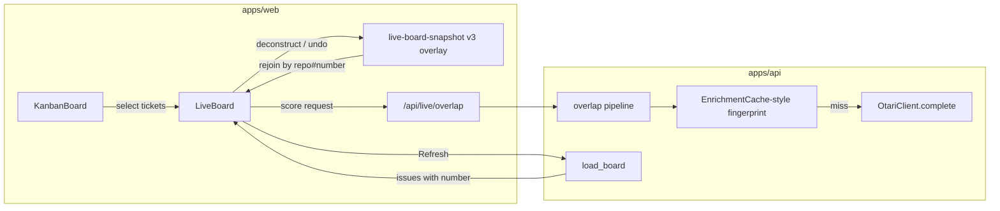
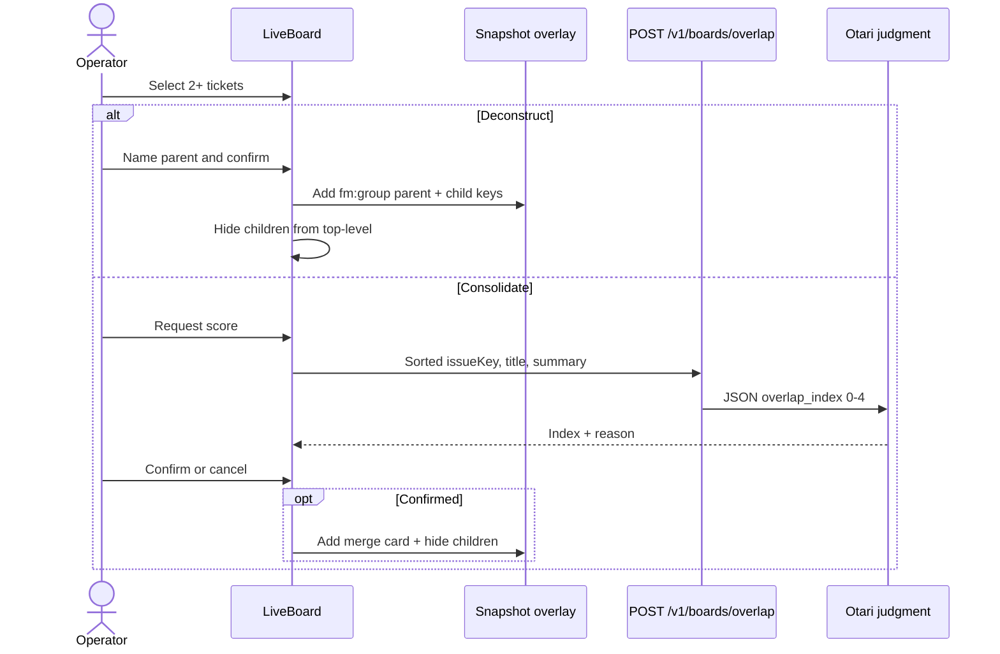
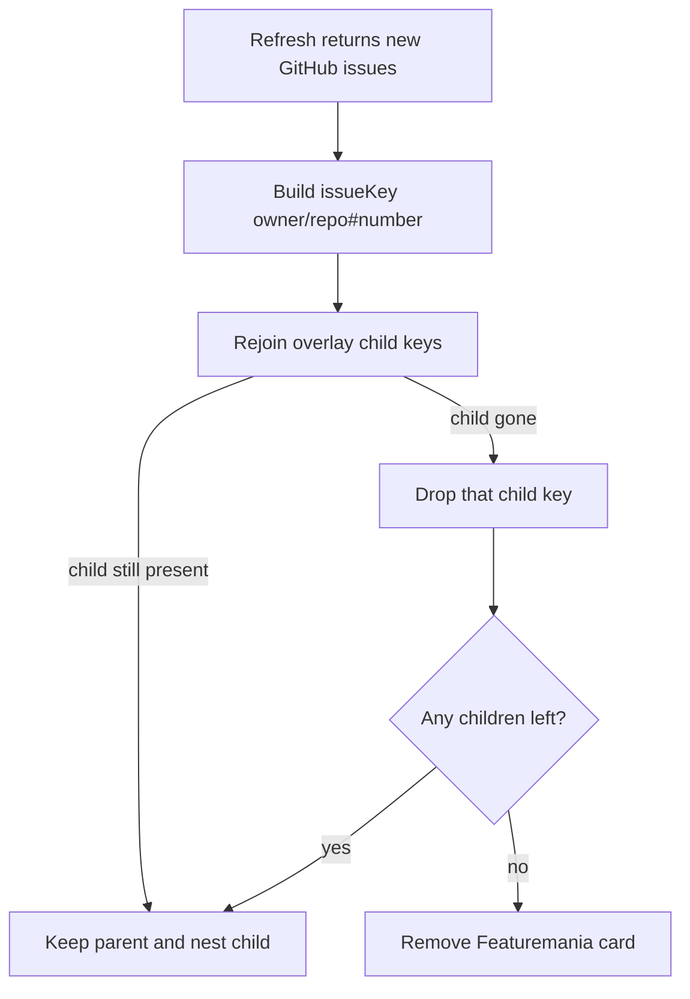

# Deconstruct and Consolidate Issues - Plan

## Goal Capsule

- **Objective:** On the live board, select tickets and either Deconstruct them under a new Featuremania parent or Consolidate them after an Otari overlap score and an explicit confirm. Grouping is Featuremania-only. The header says FeatureMania and the vault mark is a transparent PNG.
- **Product authority:** This Product Contract. Live-loop and snapshot plans still govern scrape, Otari enrichment, work-index scores, GitHub-mirrored columns, and snapshot wipe-on-sign-out. This plan does not write to GitHub.
- **Stop conditions:** Stop if the work requires creating, linking, closing, or converting GitHub issues. Stop if grouping is keyed on SQLite `Issue.id` or stored in wipe-on-load SQLite rows. Stop if `subtasks_count` is reused as a parent/child field.
- **Execution profile:** Code. Overlay reducers and overlap JSON are test-first. Brand assets are visual/smoke.
- **Open blockers:** None.

---

## Product Contract

### Summary

Select tickets on the live board, then Deconstruct them into subtasks of a new Featuremania parent or Consolidate overlapping ones. Consolidate asks Otari for an overlap index, then waits for confirm before merging locally. Also: FeatureMania wordmark at the top left, and a transparent vault PNG for the tab favicon and header mark. GitHub issues stay unchanged.

### Problem Frame

Featuremania exists to make issue work easier. The same work often appears as several tickets, or one ticket needs to be broken into smaller pieces. Today the board can only scrape, score, and enrich. There is no selection, no local grouping, and no overlap judgment. Refresh replaces SQLite issue rows, so any grouping stored there would vanish. The header already shows a vault plus "Featuremania", but the PNGs sit on a white square and the wordmark is not FeatureMania.

### Requirements

- R1. The operator can select two or more painted tickets and choose Deconstruct or Consolidate.
- R2. Deconstruct creates a new Featuremania parent card. The selected tickets become its subtasks and leave the top-level columns.
- R3. Consolidate asks Otari for an overlap index and a grounded reason, then shows that result before any merge.
- R4. Consolidate merges only after the operator confirms. A low score does not block confirm; it warns.
- R5. Grouping is Featuremania-only. Refresh keeps the overlay. Sign-out or a different GitHub user wipes it with the snapshot.
- R6. A Featuremania parent or merge card can be undone. Hidden GitHub tickets return to the top-level columns.
- R7. Work-index scoring is unchanged. Featuremania cards do not invent `subtasks_count` or a fake work index.
- R8. Columns stay a GitHub projection and are not drag-and-drop.
- R9. The header wordmark is FeatureMania.
- R10. Favicon and header vault are PNG with a transparent background. Only the vault is visible on a dark header and dark browser tab.

### Actors

- A1. Signed-in operator on the live board.

### Key Flows

- F1. Deconstruct: A1 selects tickets, names a parent, confirms. A new Featuremania parent appears. Children nest under it.
- F2. Consolidate: A1 selects tickets, requests a score, reads the overlap index and reason, confirms or cancels. Confirm hides the originals under one Featuremania card.
- F3. Refresh: scrape replaces GitHub issue payloads. The overlay rejoins by `owner/repo#number`. Missing children are dropped. Featuremania parents with no remaining children are removed.
- F4. Undo: A1 dissolves a Featuremania card. Children reappear as top-level tickets.
- F5. Sign-out or user change: snapshot wipe includes grouping.

### Acceptance Examples

- AE1. Covers F1. Given two selected GitHub tickets, when A1 deconstructs and names "Auth cleanup", then a Featuremania parent titled Auth cleanup is on the board and those two tickets are no longer top-level.
- AE2. Covers F2. Given two selected tickets, when Otari returns overlap 4 and A1 confirms, then one Featuremania card remains and the two GitHub tickets are hidden under it.
- AE3. Covers F2. Given the same selection, when Otari returns overlap 0 and A1 cancels, then the board is unchanged.
- AE4. Covers F3. Given a deconstruct overlay, when A1 Refresh succeeds, then the parent is still there and children rematch by repo and number even though SQLite `id` values changed.
- AE5. Covers F5. Given grouping in the snapshot, when A1 signs out, then a later visit as another user does not show those titles.
- AE6. Given the header and tab icon on a black background, when the page loads, then the vault has no white square and the wordmark is FeatureMania.

### Success Criteria

An operator can group and ungroup tickets without touching GitHub, keep those groups across Refresh, and trust Otari's overlap index as advice rather than an automatic merge. The brand lockup is FeatureMania plus a vault on transparency.

### Scope Boundaries

#### In scope

Local multi-select, Featuremania parent/merge overlay, Otari overlap score, confirm-then-merge, undo, Refresh rehydrate, FeatureMania wordmark, transparent vault PNG plus an opaque apple-touch icon.

#### Deferred to Follow-Up Work

Write-back to GitHub (create parent issues, native sub-issues, close-as-duplicate). Auto-scan the whole board for merge candidates. Promoting an existing GitHub ticket to parent.

#### Out of scope

Drag-and-drop columns. Changing the work-index formula. Storing Featuremania parents as SQLite `Issue` rows. Cross-user shared grouping on the API process.

---

## Planning Contract

### Key Technical Decisions

- KTD1. Grouping is Featuremania-only. `(session-settled: user-directed — chosen over writing parent/child or merges to GitHub: first ship local grouping that Refresh can keep)`
- KTD2. Deconstruct always mints a new Featuremania parent. `(session-settled: user-directed — chosen over promoting a selected GitHub ticket: a GitHub identity would collide with the next scrape)`
- KTD3. Otari scores first; the operator confirms the merge. `(session-settled: user-directed — chosen over auto-merge above a threshold: the score is advice)`
- KTD4. Persist grouping as a snapshot overlay keyed by GitHub `owner/repo#number`, not SQLite `id`. `load_board` deletes and reinserts `Issue` rows, so `_serialize_issue` `id` changes every Refresh. `asIssue` today drops unknown fields, so the overlay must be a sibling of `issues[]`, not extra keys stuffed onto cards and then clobbered by `runLoad`.
- KTD5. Do not store Featuremania parents in SQLite. The API live board is one process-global row. Snapshot is the only per-GitHub-user store.
- KTD6. Overlap score is a named 0–4 index plus a grounded reason, not a percent. Labels: 0 none, 1 weak theme, 2 related, 3 substantial overlap, 4 same work. Threshold ≥3 highlights "likely worth consolidating" in the confirm dialog only. Copy must not say percent. Mirror `EnrichmentPipeline`: JSON-only, `judgment_model`, `fingerprint(model, prompt)`, one N-way call with sorted issue keys, clamp and drop hallucinated citations.
- KTD7. Featuremania cards do not participate in `compute_score`. Do not increment `subtasks_count`. Parent/merge cards omit the work-index badge.
- KTD8. Synthetic identity is `fm:group:<uuid>` minted once and stored. React keys and overlay use `issueKey`. GitHub `id` stays the unstable SQLite PK for existing cards.
- KTD9. Favicon and `brand-vault.png` are true-alpha PNGs. `apple-touch-icon.png` stays a separate 180×180 opaque PNG on a brand fill. Apple composites transparent touch icons on black.
- KTD10. Work index is not percent complete. `(session-settled: user-directed — chosen over a percent badge)`
- KTD11. Columns mirror GitHub and are not drag-and-drop. `(session-settled: user-directed — chosen over local column edits)`
- KTD12. Otari is the model used for issue judgment. `(session-settled: user-approved — chosen over skipping Otari after the org-key fix)`
- KTD13. Overlap prompts use client-sent `issueKey`, title, and summary only. The painted card has no `body`, and SQLite is one process-global live board, so the API must not look up issue text from `Issue` rows. Do not add `body` to the snapshot.
- KTD14. Only GitHub tickets with an `issueKey` can be selected. Featuremania parent and merge cards are not grouping targets. Deconstruct requires a non-empty title.

Product Contract preservation: bootstrap from this request. No upstream requirements-only plan.

### High-Level Technical Design

### Assumptions

None left unlabeled. Inferred bets were confirmed in scoping: Featuremania-only, new parent, score-then-confirm.

### Implementation Constraints

- Mirror `proxyLiveApi` for the overlap BFF. GitHub token stays server-side.
- Overlay writes go to `localStorage` on every grouping mutation. Failed writes must not crash the board.
- Vitest jsdom may lack `localStorage` on Node 25+ unless the existing setup polyfill is present (`apps/web/vitest.setup.ts`).
- Snapshot must never store access tokens or Otari keys.

---

## Implementation Units

### U1. FeatureMania wordmark and transparent vault

**Goal:** Header says FeatureMania. Favicon and header vault show only the vault on a transparent PNG.

**Requirements:** R9, R10, AE6

**Dependencies:** None

**Files:**
- `apps/web/app/layout.tsx`
- `apps/web/public/favicon.png`
- `apps/web/public/brand-vault.png`
- `apps/web/public/apple-touch-icon.png`
- `apps/web/app/globals.css`
- `apps/web/__tests__/brand-mark.test.ts` (create)

**Approach:** Keep the existing `/brand-vault.png` and `/favicon.png` paths. Replace those two files with true-alpha PNGs cut from the operator-supplied vault art, anti-aliased against transparency rather than flattened on white. Keep `apple-touch-icon.png` as a separate 180×180 opaque asset on a dark or gold fill. Change the visible wordmark and `metadata.title` to FeatureMania. Do not wrap the mark in a white tile in CSS.

**Execution note:** This is assets and copy. Prefer a visual check on a dark header and a dark browser tab over unit coverage of pixels.

**Patterns to follow:** Current lockup in `apps/web/app/layout.tsx` (`.app-brand` + `.app-brand-mark`).

**Test scenarios:**
- Happy path: layout text is FeatureMania; icon URLs still point at `/favicon.png` and `/brand-vault.png`.
- Edge: `apple-touch-icon.png` remains a different URL from the favicon.
- Test expectation for pixel alpha: none in unit tests — verify by opening the PNGs and the header on a black background.

**Verification:** Header lockup is FeatureMania plus a vault with no white square. Tab icon is the vault only. Apple touch icon is opaque.

### U2. Stable GitHub identity on the client

**Goal:** Every painted GitHub issue carries `number` and an `issueKey` of `owner/repo#number` so grouping can survive Refresh.

**Requirements:** R5, AE4

**Dependencies:** None

**Files:**
- `apps/api/src/live/load.py`
- `apps/api/tests/test_live_load.py`
- `apps/web/components/KanbanBoard.tsx`
- `apps/web/lib/live-board-snapshot.ts`
- `apps/web/__tests__/live-board-snapshot.test.ts`

**Approach:** Add `number` to `_serialize_issue`. Extend `KanbanIssue` and `asIssue` to keep `number` and derive `issueKey`. v2 snapshots without `number` still paint; grouping actions require `issueKey` and stay disabled until a load that includes `number`. Do not key anything new on `id`.

**Execution note:** Start with failing tests that Refresh-equivalent payloads with new `id` values still produce the same `issueKey`.

**Patterns to follow:** `_serialize_issue` field list; `asIssue` whitelist; unique constraint `uq_issue_board_repo_number`.

**Test scenarios:**
- Happy path: serialized issue includes `number`; client `issueKey` is `mozilla-ai/otari#12`.
- Edge: v2 snapshot without `number` still reads titles and scores.
- Error: missing `repo` or `number` yields no `issueKey`; grouping cannot target that card.
- Integration: load test still replaces SQLite rows and returns a new `id` with the same `number`.

**Verification:** After a mocked reload with new PKs, `issueKey` is unchanged.

### U3. Multi-select and deconstruct overlay

**Goal:** Select tickets and create a Featuremania parent whose children leave the top-level columns.

**Requirements:** R1, R2, R6, R7, R8, AE1

**Dependencies:** U2

**Files:**
- `apps/web/lib/live-grouping.ts` (create)
- `apps/web/lib/live-board-snapshot.ts`
- `apps/web/components/LiveBoard.tsx`
- `apps/web/components/KanbanBoard.tsx`
- `apps/web/components/IssueCard.tsx`
- `apps/web/__tests__/live-grouping.test.ts` (create)
- `apps/web/__tests__/live-board.test.tsx`
- `apps/web/__tests__/kanban.test.tsx`

**Approach:** Bump snapshot schema to v3 with a per-named-board `groups[]` of `{ id: fm:group:<uuid>, title, childKeys[], mode: "parent" | "merge" }`. Selection lives in `LiveBoard`, not drag. Clicking the work-index badge still opens the score dialog and does not toggle selection. Only GitHub cards with `issueKey` are selectable (KTD14). Deconstruct asks for a non-empty title, mints a parent group, persists immediately. Parent card sits in Backlog (no GitHub status). Children render nested under the parent, not as duplicate top-level cards. Undo removes the group and restores children. Cards cannot be dragged.

**Execution note:** Implement overlay reducers test-first before wiring the action bar.

**Patterns to follow:** Snapshot v1→v2 migrate in `parseSnapshot`; score dialog in `IssueCard`; named-board write path in `writeLiveBoardSnapshot`.

**Test scenarios:**
- Happy path: two selected `issueKey`s plus title "Auth cleanup" yields one parent group and those keys absent from top-level.
- Edge: one selected ticket keeps Deconstruct disabled. Empty parent title keeps confirm disabled. Featuremania cards are not selectable. Cross-repo children are allowed.
- Error: localStorage setItem throws; in-memory board still shows the new parent.
- Integration: `writeLiveBoardSnapshot` round-trips v3 `groups` and still wipes on `githubUserId` change.
- Regression: cards are still not draggable; work-index click does not select.

**Verification:** AE1 passes in `live-board.test.tsx`. Existing kanban column and work-index tests still pass.

### U4. Otari overlap score and confirm-merge

**Goal:** Selected tickets get one N-way overlap index from Otari. Merge happens only after confirm.

**Requirements:** R3, R4, R7, AE2, AE3

**Dependencies:** U2, U3

**Files:**
- `apps/api/src/enrichment/overlap.py` (create)
- `apps/api/src/main.py`
- `apps/api/src/enrichment/cache.py` (reuse)
- `apps/api/tests/test_overlap.py` (create)
- `apps/api/tests/test_enrichment_cache.py` (extend if a dedicated overlap fingerprint helper is added)
- `apps/web/app/api/live/overlap/route.ts` (create)
- `apps/web/lib/github-bff.ts`
- `apps/web/components/LiveBoard.tsx`
- `apps/web/__tests__/live-board.test.tsx`

**Approach:** New `POST /v1/boards/overlap` behind the same bearer auth as load. Body is the selected cards' sorted `issueKey`s plus title and summary only (KTD13). `build_prompt` is public and is the cache key with `judgment_model`. Response is `{ overlap_index, reason, cited_issue_keys }` after clamp to 0–4 and intersection with provided keys. Invalid JSON or hallucinated keys become a warning and no score, same fail-soft posture as enrichment. Client shows the labeled index, the reason, and a confirm dialog. ≥3 reads as likely worth consolidating; 0–2 warns but still allows confirm. Confirm writes a `mode: "merge"` group and hides children. Cancel writes nothing. Do not call any GitHub write API. Do not read SQLite `Issue.body` for this call.

**Execution note:** Start with a failing API test for the JSON contract and cache hit on the same sorted set.

**Patterns to follow:** `EnrichmentPipeline.build_prompt` + `fingerprint`; `proxyLiveApi` in `apps/web/app/api/live/load/route.ts`; per-issue Otari fallback in `load_board`.

**Test scenarios:**
- Happy path: two issues, model returns 4 and cites both keys; client confirm creates a merge group.
- Edge: same two issues in reverse order produce the same fingerprint. Index 0 still shows confirm, labeled as not overlapping.
- Error: Otari timeout or bad JSON returns a warning and leaves the board unchanged. Cited key not in the request is stripped; if none remain valid and index > 0, treat as invalid.
- Integration: BFF forwards bearer to `/v1/boards/overlap`. Network log of the confirm path has no GitHub issue-write URL.

**Verification:** AE2 and AE3 pass. Enrichment cache tests still pass. No GitHub mutation helpers are imported.

### U5. Rehydrate after Refresh and undo

**Goal:** Refresh keeps grouping. Sign-out wipes it. Undo restores children.

**Requirements:** R5, R6, AE4, AE5

**Dependencies:** U3, U4

**Files:**
- `apps/web/components/LiveBoard.tsx`
- `apps/web/lib/live-grouping.ts`
- `apps/web/lib/live-board-snapshot.ts`
- `apps/web/__tests__/live-board.test.tsx`
- `apps/web/__tests__/live-grouping.test.ts`

**Approach:** After a successful `runLoad`, replace `issues` from the API, then reapply `groups` by `issueKey`. Drop child keys that the new payload does not contain. Remove empty groups. Failed Refresh keeps the painted board and overlay. `wipeLiveBoardSnapshot` remains the only wipe, on sign-out or user change. Undo is available on Featuremania cards for both parent and merge modes.

**Patterns to follow:** Current `runLoad` persist-after-success; wipe on unauthenticated session in `LiveBoard`.

**Test scenarios:**
- Happy path: overlay with two child keys survives a load whose `id`s changed and whose `number`s did not.
- Edge: one child missing after Refresh; parent remains with the other child. Both missing; parent is removed.
- Error: failed Refresh leaves groups and painted issues in place.
- Integration: sign-out wipes groups; a different `githubUserId` cannot read the prior overlay.

**Verification:** AE4 and AE5 pass. Failed Refresh still keeps the board.

---

## Verification Contract

- API unit: from `apps/api`, the existing pytest suite plus `tests/test_overlap.py` and `tests/test_live_load.py` number-serialization cases. Do not require `RUN_OTARI_LIVE=1` for merge-path proof.
- Web unit: `pnpm --filter web test` covering snapshot v3, grouping reducers, live-board deconstruct/consolidate/refresh/undo, kanban selection vs score-dialog, brand wordmark.
- Manual: dark header and dark tab show a vault with no white matte. Apple home-screen icon is opaque if checked.
- Gate: no new GitHub write client. `subtasks_count` stays a score input hardcoded from scrape unless a later plan implements real GitHub subtasks.

---

## Definition of Done

- R1–R10 and AE1–AE6 are met.
- U1–U5 verification outcomes pass.
- Abandoned experiment code is not left in the diff.
- Product Contract IDs are unchanged.

---

## System-Wide Impact

Snapshot schema becomes v3. Older v2 snapshots must still paint. Load payload grows by `number`. Kanban cards gain selection chrome. Otari usage grows by one judgment call per consolidate attempt, cached by fingerprint. Auth and GitHub scrape paths are unchanged.

## Risks & Dependencies

- Unstable `id` — mitigated by KTD4 and U2 landing before grouping UI.
- Overlay clobbered by `runLoad` — mitigated by sibling `groups[]` and U5 rejoin.
- Overlap index read as percent — mitigated by KTD6 labels and copy.
- Transparent apple-touch going black — mitigated by KTD9 separate opaque file.
- localStorage quota or private mode — in-memory grouping still works; persist is best-effort.

## Sources & Research

- `apps/api/src/live/load.py` `_serialize_issue` omits `number`; `load_board` deletes all issue rows.
- `apps/web/lib/live-board-snapshot.ts` `asIssue` whitelist; schema `v: 2`.
- `apps/api/src/enrichment/pipeline.py` and `apps/api/src/enrichment/cache.py` for Otari JSON + fingerprint.
- `docs/plans/2026-08-26-002-feat-live-board-client-snapshot-plan.md` — wipe on sign-out, not on Refresh.
- `docs/plans/2026-08-26-001-board-viewport-scroll-and-scores-plan.md` — `subtasks_count` hardcoded 0; do not invent scores.
- OpenAI structured outputs and citation guidance: clamp numeric bounds in-app; cite only provided issue keys.
- MDN Web Storage: persist grouping in `localStorage`, not `sessionStorage`.
- Apple touch-icon guidance: opaque 180×180; transparency composites on black.
