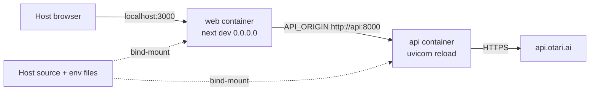

# Lean Local Docker Loop - Plan

## Goal Capsule

- **Objective:** Add a lean Docker Compose path that starts API and web the same way on any OS that has Docker, while the operator still opens `http://localhost:3000` and edits source on the host.
- **Product authority:** This Product Contract. Live-loop, snapshot, and grouping plans still govern SSO, scrape, Otari, and the board. `run.sh` stays the native macOS/Linux path.
- **Stop conditions:** Stop if the work invents an Otari sidecar, bakes secrets into an image, changes the GitHub OAuth callback off `http://localhost:3000`, or rewrites the Vercel/Railway production path.
- **Execution profile:** Code. Packaging and Compose are smoke-first. A small Compose-contract test pins the server-side API URL. Existing BFF copy that says localhost:8000 stays as-is.
- **Open blockers:** None.

---

## Product Contract

### Summary

A local Compose path starts FastAPI and Next together in lean containers. The operator still signs in at `http://localhost:3000`. Source on the host is bind-mounted so edits refresh. Hosted Otari stays outside. Keys stay in host env files. `./run.sh` is unchanged as the native path.

### Problem Frame

`./run.sh` needs host `pnpm`, `uv`, `curl`, and `lsof`. That is fine on this Mac. It is a weak compatibility story on Windows and on any machine that should not install the toolchain. Compose today only builds the API as a baked production image. The web app is not containerized. Putting Next in a container without splitting browser URLs from server-to-API URLs will break sign-in or preflight.

### Requirements

- R1. `docker compose up` starts API and web without installing Node or Python on the host.
- R2. The operator opens `http://localhost:3000/login`, signs in with GitHub, and uses the same laptop loop as today.
- R3. Edits to host source appear after refresh (web Fast Refresh and API reload).
- R4. GitHub and Otari keys stay on the host. Images do not contain `.env` or `.env.local`.
- R5. Hosted Otari stays outside the Compose file. No gateway or Ollama sidecar.
- R6. `./run.sh` still starts the native loop. Docker is additive.
- R7. The existing API production image used by Railway stays a baked, non-reload image. Local live-source is a Compose override, not a rewrite of that default command.

### Actors

- A1. Operator on any OS with Docker Desktop or an equivalent engine, plus the existing GitHub OAuth app and Otari key.

### Key Flows

- F1. First start: A1 copies keys into the two host env files, runs Compose, opens `http://localhost:3000/login`, signs in, passes preflight.
- F2. Live edit: A1 changes a web or API file on the host. The running containers pick it up without a rebuild.
- F3. Missing keys: missing Otari key still blocks the picker. Missing NextAuth secret still fails configuration. Same product rules as native.
- F4. Wrong API hop: if Next cannot reach FastAPI on the Compose network, preflight fails. The browser URL stays localhost.

### Acceptance Examples

- AE1. Covers F1 / R1 / R2. Given valid host env files and no host Node/Python requirement, when A1 runs Compose and opens `http://localhost:3000/login`, then GitHub callback returns to that localhost URL and the board loads.
- AE2. Covers F2 / R3. Given Compose is up, when A1 edits a visible web string on the host, then a browser refresh shows the change without rebuilding the image.
- AE3. Covers R4. Given a built web or API image, when the image filesystem is inspected, then it does not contain host `.env` or `apps/web/.env.local`.
- AE4. Covers F3 / R5. Given `OTARI_API_KEY` unset on the API service, when A1 is signed in, then the picker is blocked the same way as native.
- AE5. Covers R6. Given Compose is not running, when A1 runs `./run.sh` on macOS/Linux, then the native loop still starts as today.

### Success Criteria

An operator who only has Docker can run the full local loop on another OS. Sign-in, Otari, and live edit still work. Native `run.sh` users are not forced onto Docker.

### Scope Boundaries

#### In scope

Compose `web` service, lean web toolchain image, API live-source override (bind-mount + reload), polling for Docker Desktop file watches, docs for the additive path, a Compose-contract test.

#### Deferred to Follow-Up Work

Published multi-arch images on a registry. A baked snapshot image with no bind-mounts. Kubernetes. Windows-native scripts. Changing the GitHub OAuth app to a non-localhost callback.

#### Outside this product's identity

Production Vercel/Railway rewrite. An Otari or Ollama sidecar. PAT scrape. A second GitHub login on `:8000`.

---

## Planning Contract

### Summary

Extend the existing API-only Compose file. Add a lean Node toolchain image for web. Keep the current API Dockerfile as the Railway/prod default. Local Compose overrides the API command and mounts source. Browser-facing URLs stay localhost. Server-side `API_ORIGIN` becomes the Compose service name.

### Key Technical Decisions

- KTD1. Laptop loop on `localhost:3000` (session-settled: user-approved — chosen over a packaged appliance for another machine: GitHub OAuth and NextAuth stay on the existing localhost callback).
- KTD2. Live source via bind-mounts (session-settled: user-approved — chosen over a baked snapshot: host edits must refresh without an image rebuild).
- KTD3. Two Compose services, not one process image. API stays the existing uv/Python slim image. Web is a separate Node/pnpm slim image. Mixing both toolchains in one container is not lean and fights the current API Dockerfile.
- KTD4. Split the two `localhost` meanings. `NEXTAUTH_URL` and the GitHub callback stay `http://localhost:3000` (browser/host). Compose sets the Next process `API_ORIGIN` to `http://api:8000` (server-to-API on the Compose network). Do not point the browser at the `api` hostname. Do not leave `API_ORIGIN=http://localhost:8000` inside the web container. That localhost is the web container itself.
- KTD5. Local live-source is a Compose override. Keep `apps/api/Dockerfile` CMD as baked uvicorn without `--reload` for Railway. Compose adds volumes and a reload command for local. Do not make the production image the live-source story.
- KTD6. Anonymous or named volumes for Linux `node_modules`, `.next`, and API `.venv`. Do not use host Darwin/Windows binaries inside Linux containers.
- KTD7. Listen on `0.0.0.0` in both containers. `next dev` must take an explicit hostname. API already listens on `0.0.0.0` in the Dockerfile; `run.sh` still binds `127.0.0.1` on the host and that stays native-only.
- KTD8. File-watch polling in Compose (`WATCHPACK_POLLING` / equivalent for Next, reload that can see bind-mounts for API). Docker Desktop on macOS/Windows often misses inotify.
- KTD9. Do not invent an Otari sidecar. Hosted `OTARI_BASE_URL` and host `.env` remain the only gateway path.
- KTD10. Do not change the BFF 503 string that says the API is not running on localhost:8000. Existing web tests lock that copy. Compose success is proven by a healthy hop to `http://api:8000`, not by rewriting native error text.
- KTD11. Secrets stay host-side: Compose `env_file` for repo-root `.env`, Next loads `apps/web/.env.local` from the bind-mount. Both dockerignores already exclude env files. Keep that.

### High-Level Technical Design

Browser and GitHub only see localhost. Next server and FastAPI only see Compose DNS. Otari stays on the public internet.

### Assumptions

- Compose `environment:` for `API_ORIGIN` wins over a localhost value in the bind-mounted `apps/web/.env.local`. If Next 14 still prefers the file, the implementer sets the Compose value in that file for Docker runs and documents it. This was not re-verified against Next docs in this planning pass (external fetch was interrupted).
- `watchfiles` or uvicorn reload-from-stat is enough for API bind-mounts once polling or a reload extra is present. Exact extra is an implementation-time choice and must not be added to the Railway production image unless reload is gated to the local target.
- Current Compose `env_file.path` / `required: false` is available on the operator's Docker Compose.

### Implementation Constraints

- Never npm/npx. Web image uses the repo `packageManager` (pnpm 11).
- Root `.dockerignore` currently excludes `apps/web`. A repo-root web build context will omit the app unless the ignore or the context changes.
- API `envload.py` walks parents for `.env` and does not override process env. Prefer Compose `env_file` so a `/app` workdir still receives Otari keys.
- Default SQLite path is cwd-relative. If local API should keep a db across restarts, mount that file. Not required for first success.
- Do not mix native `run.sh` (API on `127.0.0.1`) with a containerized Next unless the implementer also documents `host.docker.internal`. Default story is both services in Compose, or both native.

### Sequencing

1. Web toolchain image that can run `next dev` on `0.0.0.0`.
2. Compose stack: web + API live-source override + `API_ORIGIN` + polling + volumes.
3. Docs for the additive path.
4. Compose-contract test and a smoke of the existing web/API suites.

### Sources and Research

- Repo: `docker-compose.yml`, `apps/api/Dockerfile`, `run.sh`, `.env.example`, `apps/web/next.config.mjs`, `apps/web/lib/github-bff.ts`, `apps/web/__tests__/preflight.test.ts`.
- Institutional: compose comments forbid an Otari sidecar. Live-loop plan still owns localhost SSO.
- External Next env-precedence docs were not fetched after a tool interrupt. Treat file-vs-process env as an implementation check, not as settled framework fact.

---

## Implementation Units

### U1. Lean web toolchain image

**Goal:** A small Node image that can install the pnpm workspace and run Next in the container.

**Requirements:** R1, R4, KTD3, KTD7

**Dependencies:** None

**Files:**
- `apps/web/Dockerfile` (create) or a repo-root `Dockerfile.web` if the lockfile forces a monorepo context
- `apps/web/.dockerignore` (create) if the web context is `apps/web`
- `.dockerignore` (modify) if the web context is the repo root, because it currently excludes `apps/web`

**Approach:** Toolchain image only: official slim Node, enable Corepack/pnpm to match `packageManager`, install from the lockfile, default command is `next dev` bound to `0.0.0.0`. Do not copy secrets. Do not install Python. Prefer a context that can see `pnpm-lock.yaml` and `pnpm-workspace.yaml`.

**Execution note:** This is packaging. Prove the image builds and `next` is on PATH before wiring Compose.

**Patterns to follow:** `apps/api/Dockerfile` slim base, frozen lockfile, no `.env` in the image.

**Test scenarios:**
- Happy path: image build succeeds and the default command includes an explicit non-loopback hostname.
- Edge: build context includes `apps/web` (root `.dockerignore` must not drop it).
- Error: `.env` / `.env.local` are not present in the image filesystem.

**Verification:** Image builds. `docker run` without Compose is not the operator path; Compose in U2 is the proof.

### U2. Compose local stack

**Goal:** `docker compose up` starts API and web with live source, correct server-side API URL, and host-published 3000/8000.

**Requirements:** R1, R2, R3, R5, R7, KTD1, KTD2, KTD4, KTD5, KTD6, KTD8, KTD9, KTD11

**Dependencies:** U1

**Files:**
- `docker-compose.yml` (modify)
- `apps/api/Dockerfile` (modify only if a named `dev` target is cleaner than a Compose `command:` override; default is override, keep prod CMD)

**Approach:** Add a `web` service that builds the U1 image, publishes `3000:3000`, bind-mounts repo source, keeps container `node_modules` / `.next` on a volume, sets `API_ORIGIN=http://api:8000`, sets `NEXTAUTH_URL=http://localhost:3000`, and turns on watch polling. Override the existing `api` service for local: bind-mount `apps/api/src`, run uvicorn with reload on `0.0.0.0`, keep `env_file: .env`, keep the Otari-outside comment. `depends_on` API, optionally with the existing Dockerfile healthcheck. Do not add a third service.

**Execution note:** Prefer install/runtime smoke over new application unit tests. U4 pins the Compose contract.

**Patterns to follow:** Existing `api` service `env_file` and Otari comment. `run.sh` health meaning: API `/health`, web any HTTP on `:3000/`.

**Test scenarios:**
- Covers AE1. Happy path: from the host, `http://localhost:3000/login` answers; from the web container, `http://api:8000/health` answers.
- Covers AE2. Happy path: host edit to a web file is visible after refresh without rebuild.
- Edge: host `node_modules` is not the volume used inside the web container.
- Error: API_ORIGIN inside web is `http://api:8000`, not `http://localhost:8000`.
- Integration: GitHub callback URL remains `http://localhost:3000/api/auth/callback/github`.
- Covers AE4. Error: unset `OTARI_API_KEY` still blocks the picker.

**Verification:** Compose starts both. Host browser login URL is unchanged. Container-to-container health works.

### U3. Operator docs for the additive path

**Goal:** README and env example tell an operator how to run Compose without breaking the native `run.sh` story.

**Requirements:** R6, KTD4, KTD11

**Dependencies:** U2

**Files:**
- `README.md` (modify)
- `.env.example` (modify)

**Approach:** Keep the current "copy keys, then `./run.sh`" paragraph. Add a short Docker section: need Docker, same two env files, `docker compose up`, open `http://localhost:3000/login`. State that Compose sets server `API_ORIGIN` to the API service, and that native `run.sh` still uses `http://localhost:8000`. Warn not to run both on the same ports. Do not claim Windows-native `run.sh`.

**Test expectation:** none -- documentation only.

**Verification:** A new operator can pick native or Docker from README without mixing the two `API_ORIGIN` values.

### U4. Compose contract tests

**Goal:** Pin the load-bearing Compose decisions so a later edit cannot silently restore localhost-inside-the-web-container.

**Requirements:** R2, KTD4, KTD10

**Dependencies:** U2

**Files:**
- `apps/web/__tests__/compose-local-loop.test.ts` (create)
- `apps/web/__tests__/preflight.test.ts` (do not change the localhost:8000 503 assertion)
- `apps/web/__tests__/live-board.test.tsx` (same)

**Approach:** Read `docker-compose.yml` as text (same style as existing CSS-contract tests in `live-board.test.tsx`). Assert a `web` service exists, `API_ORIGIN` is the Compose API hostname, ports 3000 and 8000 are published, and the file still forbids an Otari sidecar in comments. Do not rewrite BFF error copy.

**Patterns to follow:** `apps/web/__tests__/live-board.test.tsx` reading `globals.css` with `readFileSync`.

**Test scenarios:**
- Happy path: compose file includes a web service and `API_ORIGIN` containing `http://api:8000`.
- Happy path: existing preflight test still expects the native localhost:8000 503 string.
- Edge: compose file still contains the no-Otari-sidecar comment.
- Error: a compose file that only publishes API would fail this new test.

**Verification:** `CI=true pnpm --filter web test` passes, including the new file and the unchanged BFF tests.

---

## Verification Contract

- `CI=true pnpm --filter web test` including U4.
- `cd apps/api && uv run pytest -q` still passes. No API behavior change is required.
- `pnpm --filter web exec tsc --noEmit` if web package scripts changed.
- Smoke (not CI): `docker compose up --build`, host `http://localhost:3000/login`, container `curl` to `http://api:8000/health`, one host-file edit visible on refresh, image inspect shows no env files.
- Do not require `RUN_OTARI_LIVE=1` to merge the Docker path.

---

## Definition of Done

- R1-R7 are met. AE1-AE5 are demonstrated or explicitly blocked with a plan-consistent reason.
- KTD1 and KTD2 remain: localhost login, live bind-mounts.
- Railway/prod API Dockerfile default command is still baked, no reload.
- No Otari sidecar. No secrets in images. No GitHub write APIs.
- U4 tests pass. Existing preflight/live-board API-down copy is unchanged.
- Abandoned Dockerfile experiments are not left in the tree.
- README documents both `./run.sh` and `docker compose up`.

---

## Risks and Dependencies

- Docker Desktop bind-mounts may still miss reloads even with polling. If that happens, document a container restart as the fallback. Do not treat it as a product failure.
- Port 3000/8000 conflict if `run.sh` is already up. README must say pick one.
- Next may load `API_ORIGIN` from `.env.local` after Compose sets it. Implementation must prove which wins and document the loser.
- `uvicorn --reload` without `watchfiles` may be weak in the slim image. Add the extra only on the local override path.
- Operator still needs a GitHub OAuth app pointed at localhost:3000. Docker does not remove that.

## System-Wide Impact

Developers on Windows or a clean machine get a supported run path. Native macOS/`run.sh` users are unchanged. Production deploy files stay out of this diff except an optional named target on the API Dockerfile if that is cleaner than a Compose command override.
